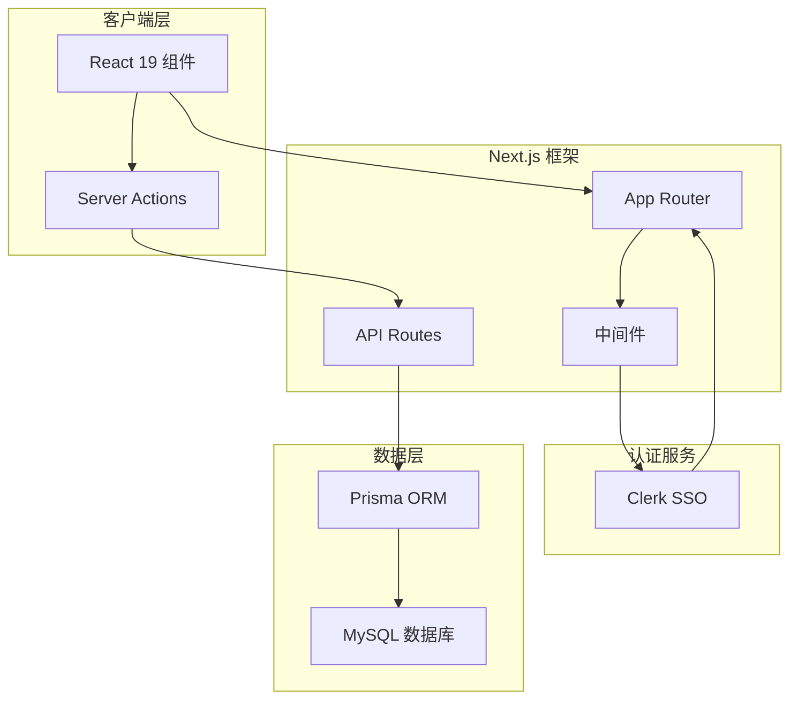
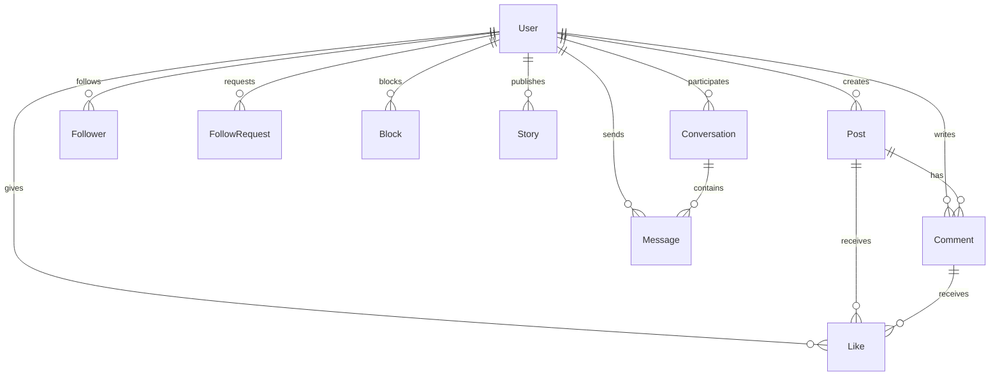

本项目是一个基于 **Next.js 15** 和 **TypeScript** 构建的社交网络类 Web 应用，提供了完整的用户认证、动态发布、即时通讯、社交关注以及中国传统文化「八字」计算等功能。项目的设计灵感来源于经典社交平台界面，采用现代化的全栈开发技术栈实现前端交互与后端数据管理的完整闭环。

项目的核心目标是为开发者提供一个功能完备的社交平台开发模板，涵盖从数据库设计、用户认证、API 路由到前端组件化的完整实现路径。通过本项目，开发者可以快速掌握 Next.js App Router 的应用架构、Prisma ORM 的数据库建模、以及 Clerk 认证系统的集成方法。

## 技术架构概览

项目的技术选型体现了当前 Web 开发领域的主流趋势，结合了前沿的框架版本与成熟的第三方服务。以下架构图展示了各技术组件之间的逻辑关系与数据流向：



如架构图所示，客户端请求首先经过 Next.js 路由层，其中间件机制负责验证用户身份（通过 Clerk），随后根据请求类型分发至 Server Actions 或 API Routes 进行业务处理，最终通过 Prisma ORM 与 MySQL 数据库进行数据交互。

## 项目技术栈

本项目采用的技术栈经过精心筛选，每个依赖项都服务于特定的开发需求。下面表格详细说明了各技术组件的版本信息与主要用途：

| 技术类别 | 组件名称 | 版本号 | 核心功能 |
|---------|---------|--------|---------|
| 框架 | Next.js | 15.5.4 | React 全栈框架，支持 App Router 与 Server Components |
| 语言 | TypeScript | ^5 | 类型安全的 JavaScript 超集 |
| UI 库 | React | 19.1.0 | 声明式用户界面构建 |
| 样式 | Tailwind CSS | ^4 | 原子化 CSS 框架 |
| 数据库 | Prisma | ^6.16.2 | Type-safe ORM 工具 |
| 数据库 | MySQL | - | 关系型数据库（需自行配置） |
| 认证 | Clerk | ^5.7.5 | 社交登录与用户管理 |
| 验证 | Zod | ^4.1.12 | TypeScript 优先的数据校验 |
| 日历 | lunar-javascript | ^1.7.7 | 农历与八字计算 |
| 云存储 | next-cloudinary | ^6.16.0 | 图片上传与 CDN 分发 |

项目依赖配置来源于 `package.json` 的 `dependencies` 和 `devDependencies` 字段，这些包通过 npm 包管理器进行版本锁定，确保在不同开发环境下的一致性。Sources: [package.json](package.json#L1-L36)

## 核心功能模块

基于对数据库模型与组件结构的分析，本项目实现了以下核心功能模块，每个模块都在代码中有明确的实现对应：

### 用户认证系统

项目集成了 Clerk 作为认证解决方案，支持社交账号登录（GitHub、Google 等），并通过自定义中间件实现路由级别的访问控制。用户数据通过 Clerk 管理，数据库中的 User 模型通过唯一 ID 与 Clerk 用户进行关联。Sources: [prisma/schema.prisma](prisma/schema.prisma#L8-L20)

### 动态帖子系统

用户可以发布包含文本和图片的动态帖子，其他用户能够对这些帖子进行评论和点赞。数据库设计了 Post、Comment、Like 三个核心模型，并通过外键关系形成完整的数据关联。Sources: [prisma/schema.prisma](prisma/schema.prisma#L22-L63)

### 八字计算器

项目独特地集成了中国传统命理功能，利用 `lunar-javascript` 库实现基于出生日期的八字（年柱、月柱、日柱、时柱）计算。这一功能在 `BaziCalculator.tsx` 组件中实现，为应用增添了文化特色。

### 即时通讯功能

完整的私信系统支持用户之间的一对一聊天。通过 Conversation 和 Message 模型设计，实现消息的发送、接收与已读状态跟踪。Sources: [prisma/schema.prisma](prisma/schema.prisma#L101-L130)

### 社交关系网络

项目实现了完整的社交图谱功能，包括粉丝关注（Follower）、关注请求（FollowRequest）和用户屏蔽（Block）机制。用户可以发送关注请求，对方同意后建立粉丝关系。Sources: [prisma/schema.prisma](prisma/schema.prisma#L65-L99)

## 数据库设计

项目采用 Prisma 作为 ORM 工具，数据库设计遵循关系型数据库的规范化原则。下图展示了主要数据模型之间的实体关系：



数据库使用 MySQL 作为存储后端，Schema 文件位于 `prisma/schema.prisma`，共定义了 10 个数据模型，覆盖了社交平台的核心业务场景。每个模型都配置了适当的级联删除规则（Cascade），确保数据一致性。

## 项目目录结构

项目的代码组织遵循 Next.js App Router 的最佳实践，将功能相关的代码按页面和组件进行模块化划分。以下是主要目录的职能说明：

```
src/
├── app/                    # Next.js 页面与路由
│   ├── api/               # API 路由端点
│   ├── friends/           # 好友相关页面
│   ├── messages/          # 消息页面
│   ├── profile/           # 个人资料页面
│   ├── settings/          # 设置页面
│   ├── sign-in/           # 登录页面
│   ├── sign-up/           # 注册页面
│   └── tools/             # 工具页面（含八字计算器）
│
├── components/            # React 组件库
│   ├── feed/              # 动态信息流组件
│   ├── leftMenu/          # 左侧导航菜单
│   └── rightMenu/         # 右侧侧边栏
│
├── lib/                   # 工具库与业务逻辑
│   ├── actions.ts         # Server Actions
│   ├── client.ts          # 客户端工具
│   └── serializeForClient.ts  # 数据序列化
│
└── middleware.ts          # 请求中间件
```

这种目录结构清晰地分离了关注点：页面路由位于 `app/` 目录，UI 组件封装在 `components/` 中，共享的业务逻辑则集中管理在 `lib/` 文件夹。Sources: [get_dir_structure](src#L1-L50)

## 页面路由体系

项目使用 Next.js App Router 构建了完整的路由体系，每个功能模块都有对应的路由入口：

| 路由路径 | 功能描述 |
|---------|---------|
| `/` | 首页/动态信息流 |
| `/sign-in` | 用户登录 |
| `/sign-up` | 用户注册 |
| `/profile/[id]` | 用户个人资料 |
| `/friends` | 好友列表与管理 |
| `/messages` | 即时通讯面板 |
| `/notifications` | 通知中心 |
| `/settings` | 账户设置 |
| `/tools/bazi` | 八字计算器工具 |

路由采用了动态路由参数（如 `[id]`）来支持用户个人资料页面的个性化展示，结合中间件机制实现访问权限控制。

## 快速开始指引

本项目已经配置了完整的开发环境，以下步骤可以帮助开发者快速启动项目：

```bash
# 安装依赖
npm install

# 配置环境变量
# 创建 .env 文件并设置 DATABASE_URL 和 CLERK 相关密钥

# 启动数据库（需要本地或远程 MySQL）
npx prisma db push

# 启动开发服务器
npm run dev
```

在继续深入学习之前，建议开发者首先了解项目的技术栈详情和配置要求。下一阶段的文档将依次介绍环境配置、数据库连接以及开发环境的完整搭建流程。

## 相关文档

完成本概述的学习后，建议按以下路径继续深入：

- 首先阅读 **[技术栈介绍](3-ji-zhu-zhan-jie-shao)** 深入了解每个技术组件的特性
- 然后参考 **[快速开始](2-kuai-su-kai-shi)** 完成本地开发环境搭建
- 接着学习 **[项目结构解析](4-xiang-mu-jie-gou-jie-xi)** 掌握代码组织方式
- 最后根据兴趣选择 **[认证系统](6-ren-zheng-xi-tong)** 或 **[数据库设计](7-shu-ju-ku-she-ji)** 进行专项深入

---

本项目的设计体现了现代 Web 应用的典型架构模式，通过实际的代码实现展示了从需求建模到技术落地的完整过程。无论是初学者还是有经验的开发者，都能从中获得有价值的实践经验。