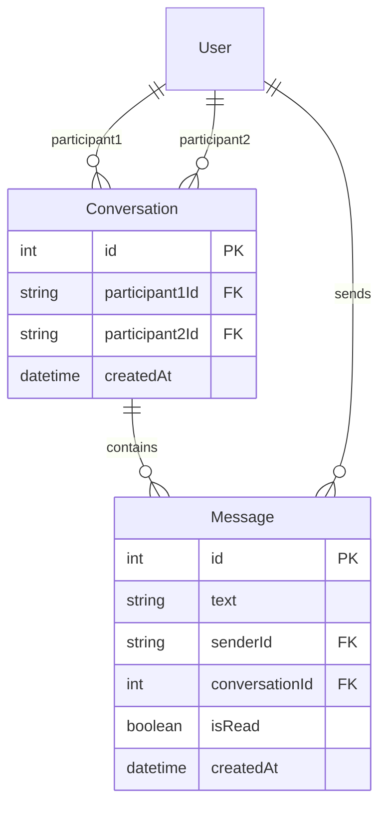
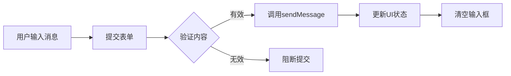

消息功能是本项目的核心社交功能之一，允许用户之间进行实时一对一私信交流。该功能采用 Next.js 的 App Router 架构，结合 Prisma ORM 与 MySQL 数据库实现数据持久化，并使用 Clerk 进行用户身份认证。

## 数据模型设计

消息功能的数据模型基于两个核心实体：**Conversation（会话）** 和 **Message（消息）**。这种设计将会话元数据与消息内容分离，既保证了查询效率，也便于后续功能扩展。



**会话模型（Conversation）** 定义了用户之间的双向会话关系。通过 `participant1Id` 和 `participant2Id` 两个外键关联用户，并使用复合唯一索引 `@@unique([participant1Id, participant2Id])` 确保任意两个用户之间最多只有一个会话。

**消息模型（Message）** 存储具体的消息内容。每条消息关联发送者（sender）和所属会话（conversation），并通过 `isRead` 字段标记已读状态。

Sources: [schema.prisma](prisma/schema.prisma#L119-L140)

## 前端组件架构

消息功能的前端实现分为两个层次：页面层和组件层。页面层位于 `src/app/messages/[receiverId]/page.tsx`，负责接收动态路由参数并获取接收者信息；组件层位于 `src/components/Chat.tsx`，封装完整的聊天界面逻辑。

### 页面层实现

页面组件采用 Server Component 模式，在服务端获取用户数据后传递给客户端组件。这种设计确保了敏感数据在服务端处理，同时保持了良好的首屏加载性能。

```typescript
const MessagePage = async ({ params }: { params: { receiverId: string } }) => {
  const receiver = await getUser(params.receiverId);
  if (!receiver) {
    notFound();
  }
  return <Chat receiver={receiver} />;
};
```

页面通过 `getUser` action 获取接收者信息，若用户不存在则返回 404 页面。

Sources: [page.tsx](src/app/messages/[receiverId]/page.tsx#L1-L16)

### 聊天组件实现

Chat 组件是消息功能的核心交互界面，提供了完整的聊天体验：



组件的核心功能包括：

| 功能 | 实现方式 | 描述 |
|------|----------|------|
| 会话加载 | `useEffect` 配合 `getConversation` | 组件挂载时获取历史消息 |
| 消息发送 | 表单提交触发 `sendMessage` | 实时更新会话状态 |
| 已读标记 | `readConversation` action | 自动标记消息为已读 |
| 自动滚动 | `useRef` + `scrollIntoView` | 新消息自动滚动到可视区域 |
| 时间格式化 | `toLocaleTimeString` | 显示友好的时间格式 |

消息气泡采用条件渲染区分发送方和接收方：发送方消息显示为天蓝色背景（`bg-sky-500`），位于右侧；接收方消息显示为白色背景，位于左侧。

Sources: [Chat.tsx](src/components/Chat.tsx#L1-L174)

## 消息交互流程

用户进入聊天页面时，组件首先通过 `getConversation` action 获取与接收者的会话历史。获取成功后，自动调用 `readConversation` 将未读消息标记为已读，确保用户再次访问时不会看到冗余的未读提示。

发送消息时，用户在输入框中输入内容并点击发送按钮（或按回车），触发 `handleSendMessage` 函数。该函数首先验证输入内容是否为空，然后调用 `sendMessage` action 将消息发送到服务端。成功后将返回的新消息合并到当前会话状态中，实现 UI 的即时更新。

## 样式设计

聊天界面采用 Telegram 风格的背景设计，使用 SVG 图案创建细腻的纹理效果：

```css
backgroundImage: `url("data:image/svg+xml,%3Csvg width='40' height='40' viewBox='0 0 40 40' xmlns='http://www.w3.org/2000/svg'%3E%3Cg fill='%23d7e3f2' fill-opacity='0.4' fill-rule='evenodd'%3E%3Cpath d='M0 40L40 0H20L0 20M40 40V20L20 40'/%3E%3C/g%3E%3C/svg%3E")`
```

这种设计不仅美观，还能有效区分消息气泡与背景区域，提升聊天记录的可读性。

## 相关功能说明

消息功能与项目的其他模块存在紧密关联：

- **用户认证**：使用 Clerk 的 `useAuth` hook 获取当前用户 ID，确保消息发送者和会话参与者的一致性
- **用户头像**：通过 Next.js 的 Image 组件加载用户头像，头像不存在时使用默认图片 `/noAvatar.png`
- **数据库关联**：消息通过外键关联到 User 和 Conversation 表，实现完整的数据一致性

如需了解用户数据的获取方式，请参阅 [客户端与服务端Actions](15-ke-hu-duan-yu-fu-wu-duan-actions)；如需了解数据库设计的更多细节，请参阅 [数据库设计](7-shu-ju-ku-she-ji)。

## 总结

消息功能采用清晰的分层架构，将数据获取逻辑封装在 Server Actions 中，界面渲染交给客户端组件处理。这种设计既保证了首屏加载性能，又实现了流畅的实时交互体验。数据库模型通过分离会话与消息实体，为后续群聊、消息撤回等扩展功能奠定了基础。