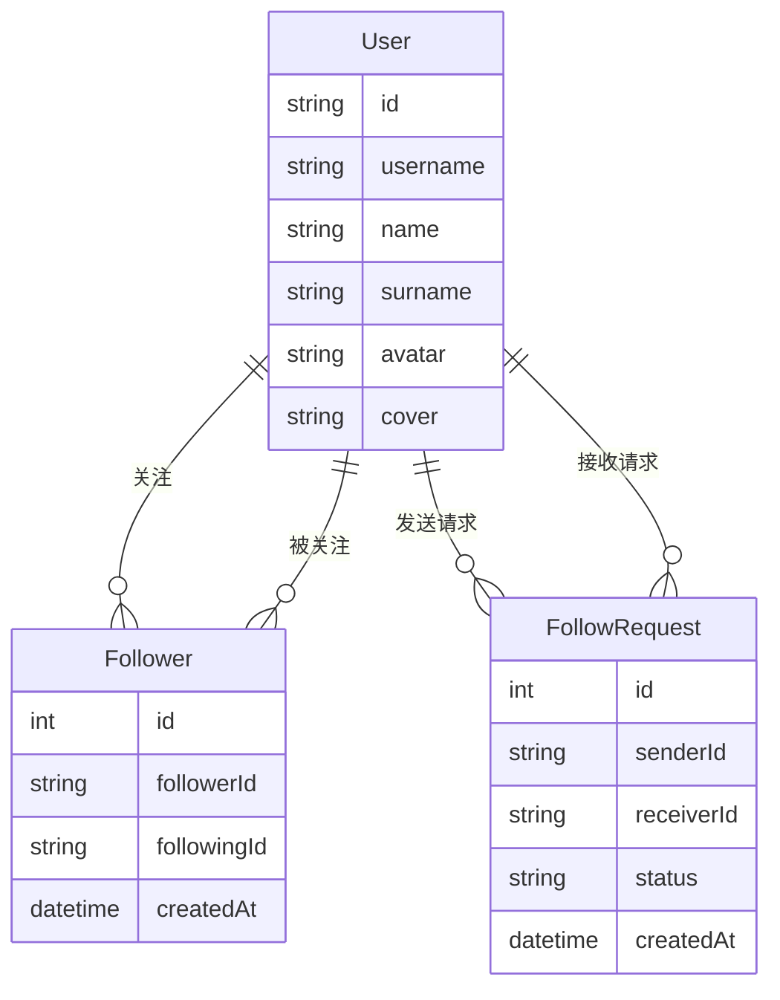
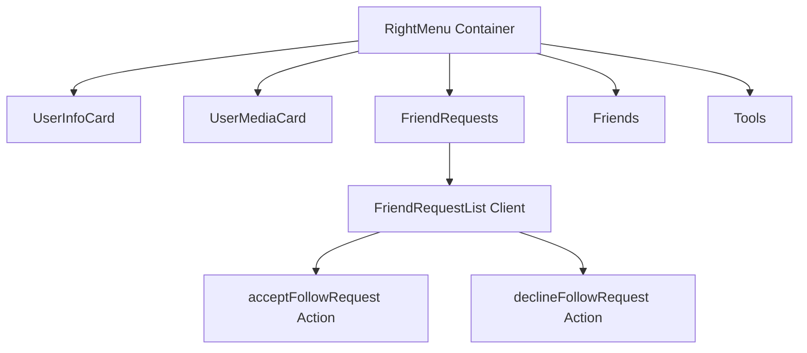

本页面详细介绍 Next.js 社交平台项目中朋友与社交功能的核心架构设计与实现机制。该系统采用**关注/粉丝模型**（Follower Model），类似于 Twitter 和 Instagram 的社交图谱设计，而非传统的好友双向确认模式。

## 社交数据模型

该项目的社交功能基于 Prisma ORM 构建，核心数据模型包括三个关键表：`Follower`（关注关系）、`FollowRequest`（关注请求）和 `User`（用户）。关注关系采用有向图结构，用户可以关注其他用户，而被关注者自动成为粉丝，形成非对称的社交关系。



关注/粉丝模型的优势在于降低了社交门槛，用户无需等待对方 approvals 即可开始关注，但系统提供了**关注请求机制**作为隐私保护的补充，当用户设置私密账号时，其他用户需要发送请求并获得批准才能关注。

Sources: [src/app/friends/page.tsx](src/app/friends/page.tsx#L1-L20), [src/components/rightMenu/FriendRequests.tsx](src/components/rightMenu/FriendRequests.tsx#L1-L18)

## 好友列表页面实现

好友列表页面（`/friends` 路由）采用 Server Component 架构，在服务器端完成数据获取和渲染。页面通过 Prisma 查询当前用户的所有关注（following）记录，并关联获取被关注用户的完整信息，包括头像、用户名、姓名等。

```typescript
// 核心数据查询逻辑
const followings = await prisma.follower.findMany({
  where: { followerId: userId },
  include: { following: true },
});
```

页面布局采用响应式网格设计，支持从单列到四列的自适应布局。列表项包含用户头像、姓名/用户名以及「发消息」快捷按钮，实现从社交关系到即时通讯的无缝衔接。每个卡片项支持悬停效果，提供流畅的交互动画体验。

Sources: [src/app/friends/page.tsx](src/app/friends/page.tsx#L22-L65)

## 右侧边栏社交组件

右侧边栏（RightMenu）是社交功能的核心展示区域，由多个模块化组件构成，形成层次分明的社交信息流。整体架构采用**组合模式**，通过 Container 组件（RightMenu）聚合独立的功能模块（UserInfoCard、UserMediaCard、FriendRequests、Friends、Tools），每个模块作为独立的 Server Component 渲染，通过 Suspense 实现流式加载。



**关注列表组件**（Friends Component）以紧凑的垂直列表形式展示当前用户的关注对象，每个列表项包含 40x40 像素的圆形头像和用户名。与完整的好友列表页面不同，右侧边栏仅展示基本信息，节省空间的同时保持社交动态的可发现性。

Sources: [src/components/rightMenu/RightMenu.tsx](src/components/rightMenu/RightMenu.tsx#L1-L30), [src/components/rightMenu/Friends.tsx](src/components/rightMenu/Friends.tsx#L1-L62)

## 好友请求处理机制

好友请求模块是私密账号功能的核心组成部分。当用户设置隐私权限后，其他用户无法直接关注，需要通过 FollowRequest 表创建关注请求。请求接收者在右侧边栏的 FriendRequests 组件中可以看到所有待处理的请求列表。

请求处理实现采用**乐观更新（Optimistic UI）**模式，使用 React 的 `useOptimistic` Hook 提升用户体验。当用户点击接受或拒绝按钮时，UI 立即反映操作结果，后台同时执行服务器操作，即使网络请求稍有延迟，用户也不会感受到界面卡顿。

```typescript
// 乐观更新核心逻辑
const [optimisticRequests, removeOptimisticRequest] = useOptimistic(
  requestState,
  (state, value: number) => state.filter((req) => req.id !== value)
);
```

处理流程包含两个关键操作：**接受请求**调用 `acceptFollowRequest` 动作，会同时创建 Follower 记录和删除 FollowRequest 记录；**拒绝请求**调用 `declineFollowRequest` 动作，仅删除 FollowRequest 记录，不建立关注关系。

Sources: [src/components/rightMenu/FriendRequests.tsx](src/components/rightMenu/FriendRequests.tsx#L1-L38), [src/components/rightMenu/FriendRequestList.tsx](src/components/rightMenu/FriendRequestList.tsx#L1-L83)

## 前后端数据流架构

社交功能采用 Next.js App Router 的 Server Action 模式处理客户端交互。Server Component 负责数据展示，后端逻辑封装在 `src/lib/actions.ts` 文件中，通过 Prisma ORM 执行数据库操作。这种架构将数据获取和 Mutations 分离到服务器端，减少客户端 JavaScript 体积，同时利用服务器的数据库连接池提高性能。

| 层级 | 组件类型 | 数据流向 | 典型操作 |
|------|----------|----------|----------|
| 展示层 | Server Components | 读取数据 | 好友列表、请求列表 |
| 交互层 | Client Components | 用户操作 | 接受/拒绝请求 |
| 服务层 | Server Actions | 处理 Mutations | 关注/取消关注 |
| 数据层 | Prisma ORM | 数据库交互 | CRUD 操作 |

客户端组件（FriendRequestList）使用 `"use client"` 指令标记，仅在需要处理用户交互时加载 JavaScript 逻辑。服务器组件则默认在服务器端渲染，首屏加载速度更快，SEO 效果更好。

Sources: [src/components/rightMenu/FriendRequestList.tsx](src/components/rightMenu/FriendRequestList.tsx#L1-L4), [src/app/friends/page.tsx](src/app/friends/page.tsx#L6-L20)

## 相关功能模块

社交功能的完善离不开其他模块的协同工作。以下模块与朋友与社交功能紧密相关：

**消息功能** — 好友列表中的「发消息」按钮直接跳转至 `/messages/{userId}` 路由，实现从社交关系到即时通讯的平滑过渡。详细实现可参考 [消息功能](10-xiao-xi-gong-neng) 文档。

**动态帖子系统** — 帖子可以关联作者信息，用户可以在动态流中查看好友发布的帖子并进行互动。详细设计见 [动态帖子系统](9-dong-tai-tie-zi-xi-tong)。

**认证系统** — 整个社交功能依赖 Clerk 提供的用户认证体系，确保用户只能访问和操作自己的社交数据。详见 [认证系统](6-ren-zheng-xi-tong)。

## 总结

本项目的社交功能采用关注/粉丝模型，实现简洁而高效的社交图谱管理。核心设计亮点包括：Server Component 驱动的数据展示、乐观更新带来的流畅交互体验、以及与消息系统的无缝集成。整体架构遵循 Next.js App Router 的最佳实践，将数据获取和业务逻辑分离到服务器端，优化了首屏加载性能和安全性。