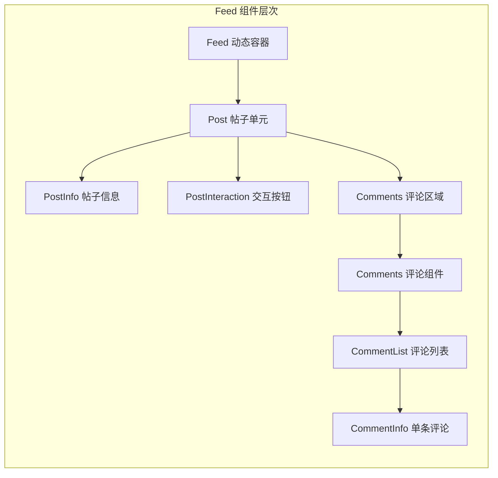

本页面介绍 Next.js 项目中前端组件的架构设计、组织结构和核心组件模式。作为连接用户界面与业务逻辑的桥梁，组件系统采用了模块化设计理念，按功能域划分为多个子目录，实现了关注点分离与代码复用。

## 组件目录架构

项目组件采用**分层目录结构**组织，所有组件位于 `src/components` 目录下，依据功能特性划分为四个主要模块：

```mermaid
graph TB
    subgraph "src/components 根目录"
        A[核心UI组件]
        B[动态帖子模块 feed]
        C[左侧菜单 leftMenu]
        D[右侧菜单 rightMenu]
    end
    
    A --> A1[Navbar 导航栏]
    A --> A2[MobileMenu 移动菜单]
    A --> A3[Search 搜索]
    A --> A4[Notifications 通知]
    A --> A5[Chat 聊天]
    A --> A6[AddPost 发帖]
    A --> A7[AddPostButton 发帖按钮]
    A --> A8[Tools 工具集]
    A --> A9[BaziCalculator 八字计算器]
    
    B --> B1[Feed 动态流]
    B --> B2[Post 帖子]
    B --> B3[Comments 评论]
    B --> B4[PostInteraction 帖子交互]
    B --> B5[CommentList 评论列表]
    B --> B6[PostInfo 帖子信息]
    B --> B7[CommentInfo 评论信息]
    
    C --> C1[LeftMenu 左侧菜单]
    C --> C2[ProfileCard 个人卡片]
    
    D --> D1[RightMenu 右侧菜单]
    D --> D2[Friends 朋友列表]
    D --> D3[FriendRequests 好友请求]
    D --> D4[UserInfoCard 用户信息卡]
    D --> D5[UserMediaCard 媒体卡片]
    D --> D6[UpdateButton 更新按钮]
    D --> D7[updateUser 用户更新]
```

Sources: [src/components](src/components)

## 组件分类与功能映射

根据组件职责，可将全部 21 个组件划分为以下四个功能域：

| 功能域 | 组件数量 | 核心职责 | 涉及页面 |
|--------|----------|----------|----------|
| **核心UI组件** | 9 | 全局导航、搜索、通知、聊天、发帖入口 | 主页、个人资料、设置 |
| **动态帖子模块 (feed)** | 7 | 动态内容展示、评论交互、社交互动 | 主页动态流 |
| **左侧菜单 (leftMenu)** | 2 | 用户profile快捷入口、功能导航 | 主页左侧 |
| **右侧菜单 (rightMenu)** | 8 | 社交关系管理、好友请求、用户信息展示 | 主页右侧 |

Sources: [AddPost.tsx](src/components/AddPost.tsx), [Feed.tsx](src/components/feed/Feed.tsx), [LeftMenu.tsx](src/components/leftMenu/LeftMenu.tsx), [RightMenu.tsx](src/components/rightMenu/RightMenu.tsx)

## 核心UI组件详解

根目录下的 9 个核心组件构成了应用的主干框架，负责全局功能的调度与展示。

**Navbar 导航栏** — 应用顶部主导航，集成搜索入口、通知图标、消息图标和个人头像，通常作为页面布局的顶层组件挂载。

**MobileMenu 移动菜单** — 针对移动端设计的响应式侧边栏菜单，提供与桌面端类似的导航功能，确保跨设备体验一致性。

**Search 搜索组件** — 全局搜索功能入口，支持用户、帖子等内容检索，通常集成在导航栏右侧区域。

**Notifications 通知中心** — 展示系统通知、好友请求、新消息等提醒信息，采用下拉面板或独立页面形式呈现。

**Chat 聊天组件** — 即时通讯功能的核心组件，支持实时消息收发与会话管理。

**AddPost / AddPostButton** — 发帖功能的入口组件，其中 AddPost 是完整的发帖表单，AddPostButton 仅提供触发入口。

**Tools 工具集** — 聚合多个辅助工具的容器组件，八字计算器等独立功能模块通过此组件统一对外暴露。

**BaziCalculator 八字计算器** — 中国传统命理计算工具，提供生辰八字分析与相关功能展示。

Sources: [Navbar.tsx](src/components/Navbar.tsx), [MobileMenu.tsx](src/components/MobileMenu.tsx), [Search.tsx](src/components/Search.tsx), [Notifications.tsx](src/components/Notifications.tsx), [Chat.tsx](src/components/Chat.tsx), [AddPost.tsx](src/components/AddPost.tsx), [Tools.tsx](src/components/Tools.tsx), [BaziCalculator.tsx](src/components/BaziCalculator.tsx)

## 动态帖子模块 (feed)

feed 目录封装了完整的社交动态系统，采用组件组合模式实现复杂交互逻辑。

**Feed** — 动态流容器组件，负责拉取、管理和渲染整个动态列表，与后端 API 服务端交互获取数据。

**Post** — 单条帖子展示单元，聚合帖子内容、作者信息、发布时间和交互按钮，响应式渲染适配不同屏幕尺寸。

**PostInfo** — 帖子元数据展示，包含作者头像、昵称、发布时间等基础信息，与 Post 组件形成 composition 关系。

**PostInteraction** — 帖子交互操作区，集成点赞、评论、分享等功能按钮及计数展示。

**Comments / CommentList / CommentInfo** — 评论功能的三层组件封装，Comments 作为顶层容器协调评论区整体逻辑，CommentList 管理评论列表渲染，CommentInfo 负责单条评论的展示。

Sources: [Feed.tsx](src/components/feed/Feed.tsx), [Post.tsx](src/components/feed/Post.tsx), [PostInfo.tsx](src/components/feed/PostInfo.tsx), [PostInteraction.tsx](src/components/feed/PostInteraction.tsx), [Comments.tsx](src/components/feed/Comments.tsx), [CommentList.tsx](src/components/feed/CommentList.tsx), [CommentInfo.tsx](src/components/feed/CommentInfo.tsx)

## 侧边栏组件系统

leftMenu 与 rightMenu 两个目录分别实现主页两侧的侧边栏功能，采用类似的组件化架构但服务于不同业务场景。

**leftMenu** 模块聚焦于用户个人信息的快捷展示与功能导航，包含 ProfileCard（个人资料卡片）组件，在左侧边栏展示当前用户的头像、昵称和关键操作入口。

**rightMenu** 模块则承担社交关系的深度管理，涵盖好友列表展示、新好友请求处理、用户信息卡片展示和用户资料更新等 8 个组件。其中 UserInfoCard 与 UserMediaCard 分别用于展示文字和媒体形式的用户信息，FriendRequests 和 FriendRequestList 协同处理好友请求的展示与处理流程，updateUser 组件提供用户资料编辑功能。

Sources: [ProfileCard.tsx](src/components/leftMenu/ProfileCard.tsx), [UserInfoCard.tsx](src/components/rightMenu/UserInfoCard.tsx), [FriendRequests.tsx](src/components/rightMenu/FriendRequests.tsx)

## 组件设计模式总结

本项目采用了以下核心组件设计模式：

| 模式 | 应用场景 | 典型组件 |
|------|----------|----------|
| **Container/Presenter** | 数据获取与展示分离 | Feed (container) → Post (presenter) |
| **Compound Components** | 紧密关联的组件组 | Comments → CommentList → CommentInfo |
| **Feature Folder** | 按功能域组织 | feed/、leftMenu/、rightMenu/ |
| **Smart/Dumb Components** | 业务逻辑与纯展示分离 | Chat (smart) vs UserMediaCard (dumb) |

这种分层的组件架构使得各模块可独立演进，降低了功能扩展的耦合度，同时便于团队协作开发与后期维护。

## 进阶学习路径

组件系统的深入理解需要结合具体实现细节与业务场景，建议按以下顺序继续学习：

- 若需了解组件在页面布局中的组织方式，请参阅 [页面路由与布局](21-ye-mian-lu-you-yu-bu-ju)
- 若关注特定组件的交互实现与状态管理，请参阅 [导航与菜单组件](13-dao-hang-yu-cai-dan-zu-jian)
- 若需理解客户端与服务端数据交互机制，请参阅 [客户端与服务端Actions](15-ke-hu-duan-yu-fu-wu-duan-actions)
- 若对样式系统感兴趣，请参阅 [Tailwind CSS样式系统](19-tailwind-cssyang-shi-xi-tong)