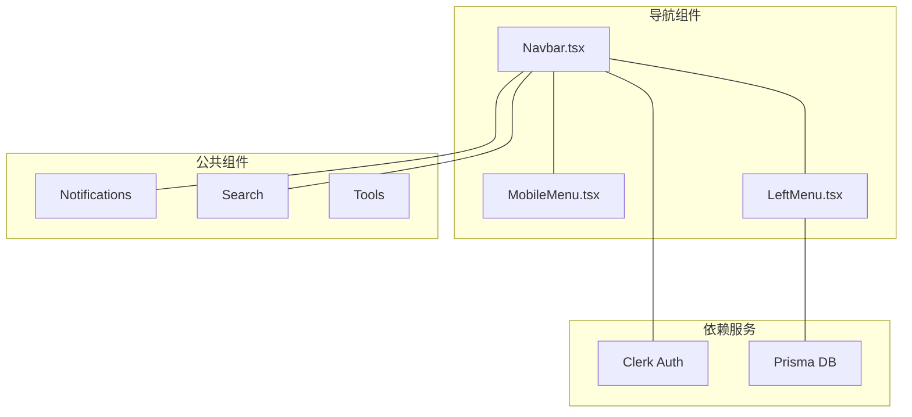

本页面详细介绍 MamaSocial 项目中的导航与菜单组件系统，包括顶部导航栏、移动端菜单和左侧菜单三个核心组件。这些组件共同构建了应用的用户界面导航架构，支持响应式布局并集成了 Clerk 用户认证系统。

## 组件架构概览

项目采用了分层导航架构：顶部 `Navbar` 作为全局导航控制中心，移动端由 `MobileMenu` 处理触控交互，左侧边栏 `LeftMenu` 提供功能入口和外链导航。



## 顶部导航栏（Navbar）

`Navbar` 组件是应用的主导航入口，位于页面顶部，具有以下功能分区：

| 区域 | 位置 | 功能描述 |
|------|------|----------|
| 左侧 | 20% 宽度 | 品牌 Logo（MAMASOCIAL），仅桌面端显示 |
| 中间 | 50% 宽度 | 导航链接（首页、好友）+ 搜索框 |
| 右侧 | 30% 宽度 | 用户认证状态、通知、用户按钮、移动端菜单 |

### 核心功能实现

**认证状态感知**：通过 Clerk 的 `SignedIn` / `SignedOut` 组件实现条件渲染，登录用户显示用户头像和通知入口，未登录用户显示登录/注册链接。

```tsx
<ClerkLoaded>
  <SignedIn>
    <Link href="/friends">
      <Image src="/people.png" alt="" width={24} height={24} />
    </Link>
    <Notifications />
    <UserButton />
  </SignedIn>
  <SignedOut>
    <Link href="/sign-in">登录/注册</Link>
  </SignedOut>
</ClerkLoaded>
```

**响应式断点**：
- **桌面端（lg及以上）**：显示完整导航，包含左侧品牌、中间链接、右侧用户控制
- **平板端（md）**：隐藏左侧品牌，保留中间导航和右侧功能
- **移动端（默认）**：仅显示右侧功能元素，由 `MobileMenu` 处理导航

Sources: [Navbar.tsx](src/components/Navbar.tsx#L1-L70)

## 移动端菜单（MobileMenu）

`MobileMenu` 组件实现了典型的汉堡菜单交互模式，专为移动设备设计，提供全屏导航体验。

### 交互设计

**动画实现**：使用三个 `div` 元素，通过条件类名变换实现经典的汉堡菜单动画效果：

```tsx
<div className={`w-6 h-1 bg-blue-500 rounded-sm ${
    isOpen ? "rotate-45" : ""
} origin-left ease-in-out duration-400`} />

<div className={`w-6 h-1 bg-blue-500 rounded-sm ${
    isOpen ? "opacity-0" : ""
} ease-in-out duration-400`} />

<div className={`w-6 h-1 bg-blue-500 rounded-sm ${
    isOpen ? "-rotate-45" : ""
} origin-left ease-in-out duration-400`} />
```

| 状态 | 第一条 | 第二条 | 第三条 |
|------|--------|--------|--------|
| 关闭 | 水平 | 可见 | 水平 |
| 打开 | 旋转45° | 透明 | 旋转-45° |

**全屏菜单面板**：打开时覆盖整个视口，包含五个核心导航链接，使用绝对定位固定在导航栏下方。

Sources: [MobileMenu.tsx](src/components/MobileMenu.tsx#L1-L39)

## 左侧菜单（LeftMenu）

`LeftMenu` 组件是侧边栏导航的核心，采用 Server Component 架构实现数据预加载，提供个人功能入口和外部资源链接。

### 数据驱动架构

组件根据当前用户动态生成个人链接：

```tsx
const { userId } = auth();
let myPostsHref = "/sign-in";
if (userId) {
    const user = await prisma.user.findUnique({
        where: { id: userId },
        select: { username: true },
    });
    if (user?.username) myPostsHref = `/profile/${user.username}`;
}
```

### 菜单结构设计

| 分类 | 类型 | 数据来源 |
|------|------|----------|
| 个人 | 动态 | 根据认证状态从 Prisma 获取用户信息 |
| 发现 | 静态 | 硬编码的外部育儿资源链接 |

**外部链接处理**：组件通过正则表达式检测 `http://` 或 `https://` 前缀，自动选择渲染 `<a>` 标签（带 `target="_blank"`）或 Next.js `<Link>` 组件。

Sources: [LeftMenu.tsx](src/components/LeftMenu.tsx#L1-L90)

## 响应式设计策略

项目导航系统采用移动优先策略，通过 Tailwind CSS 断点类实现自适应：

- **隐藏策略**：`md:hidden` 使 MobileMenu 仅在移动端显示
- **显示策略**：`md:flex` 使中间导航在平板及以上设备显示
- **宽度适配**：使用百分比配合最大/最小宽度限制，确保在大屏幕上的可读性

## 与其他组件的关系

导航系统与多个组件存在协作关系：

- **Search 组件**：嵌入在 Navbar 中间区域，提供全局搜索功能
- **Notifications 组件**：集成在 Navbar 右侧，展示实时通知
- **Tools 组件**：嵌入在 LeftMenu 中，提供快捷工具入口

这种分层设计确保了导航逻辑的内聚性，同时保持了组件间的松耦合。

## 相关文档

- [搜索与通知组件](14-sou-suo-yu-tong-zhi-zu-jian) - 了解 Navbar 依赖的 Search 和 Notifications 组件
- [组件系统概述](12-zu-jian-xi-tong-gai-shu) - 理解组件架构设计思想
- [Tailwind CSS 样式系统](19-tailwind-cssyang-shi-xi-tong) - 掌握响应式设计工具类
- [认证系统](6-ren-zheng-xi-tong) - 深入了解 Clerk 集成机制