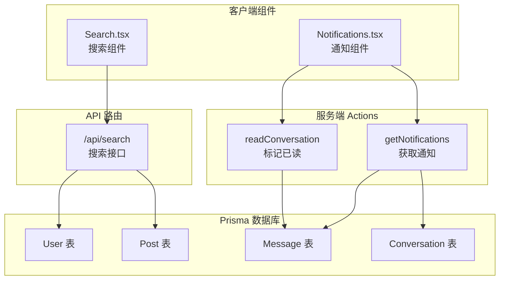
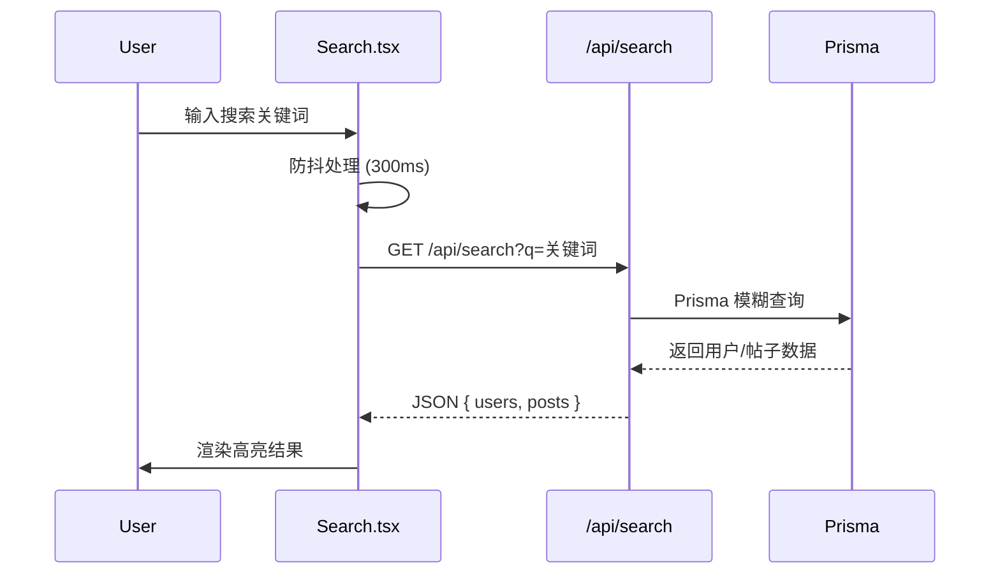

本文档详细介绍项目中搜索与通知两大核心交互组件的架构设计与实现机制。这两个组件构成了用户发现内容和接收实时信息的关键入口，是社交平台用户体验的重要组成部分。

## 组件概览

搜索组件（Search）和通知组件（Notifications）分别负责用户的内容发现和消息提醒功能。两者均采用客户端组件架构，通过与后端API和服务端Actions进行交互，实现数据的实时获取与处理。下图展示了两个组件的整体架构关系：



## 搜索组件（Search.tsx）

### 核心功能特性

搜索组件实现了用户和动态帖子的模糊搜索功能，具备以下特性：

| 特性 | 说明 |
|------|------|
| **防抖搜索** | 300ms 延迟输入，减少不必要的 API 请求 |
| **中止控制器** | 快速输入时自动取消上一次的请求，避免竞态条件 |
| **高亮匹配** | 搜索关键词在结果中以黄色背景高亮显示 |
| **点击外部关闭** | 点击搜索区域外部自动关闭下拉结果面板 |
| **用户/帖子双分类** | 搜索结果按用户和动态两个维度分类展示 |

### 实现原理

搜索组件使用 `useDebouncedValue` 自定义 Hook 实现输入防抖。当用户输入时，系统会等待 300 毫秒再发起搜索请求，如果在这期间用户继续输入，则清除上一次定时器并重新计时。这种机制有效避免了每个按键都触发搜索的性能问题。

组件内部维护一个 `AbortController` 引用，每次发起新请求前都会调用 `abort()` 方法取消之前的请求。这解决了快速输入场景下的竞态条件问题——确保用户最终看到的是最新输入对应的搜索结果，而非旧请求的滞后响应。

```typescript
// 核心防抖逻辑
const useDebouncedValue = (value: string, delay = 300) => {
  const [debounced, setDebounced] = useState(value);
  useEffect(() => {
    const t = setTimeout(() => setDebounced(value), delay);
    return () => clearTimeout(t);
  }, [value, delay]);
  return debounced;
};
```

搜索结果的高亮功能通过正则表达式实现。`Highlight` 组件将匹配文本按关键词分割为数组，偶数索引位置为非匹配部分，奇数索引位置为匹配部分（用 `<mark>` 标签包裹）。值得注意的是，正则表达式构建放在 try-catch 块中，以应对用户输入特殊字符导致的正则表达式语法错误。

Sources: [Search.tsx](src/components/Search.tsx#L1-L209)

### 搜索 API 路由

搜索功能的后端实现位于 `/api/search` 路由。该接口接受 `q` 查询参数，返回用户和帖子两组数据：

```typescript
// 搜索条件支持多字段模糊匹配
const [users, posts] = await Promise.all([
  prisma.user.findMany({
    where: {
      OR: [
        { username: { contains: q } },
        { name: { contains: q } },
        { surname: { contains: q } },
        { description: { contains: q } },
      ],
    },
    take: 5,  // 限制返回值数量
  }),
  prisma.post.findMany({
    where: {
      OR: [{ desc: { contains: q } }],
    },
    take: 5,
  }),
]);
```

接口使用 `Promise.all` 并行查询用户和帖子表，提升响应速度。查询条件使用 Prisma 的 `contains` 操作符实现模糊匹配，同时限制每次最多返回 5 条结果，避免返回过多数据影响渲染性能。

Sources: [route.ts](src/app/api/search/route.ts#L1-L60)

## 通知组件（Notifications.tsx）

### 核心功能特性

通知组件负责展示用户未读消息通知，具备以下特性：

| 特性 | 说明 |
|------|------|
| **未读消息聚合** | 实时获取用户未读消息，按发送者去重显示 |
| **轮询更新** | 每 30 秒自动轮询检查新通知 |
| **已读标记** | 点击通知后自动标记对应会话为已读状态 |
| **即时清除** | 已读通知从列表中移除，红点计数同步更新 |
| **跳转消息页面** | 点击通知项跳转到对应私信对话页面 |

### 数据获取机制

通知组件在用户登录后立即获取未读消息，同时设置定时器每 30 秒重新拉取数据。这种实现方式相较于 WebSocket 推送更为简单，适合中小规模的社交应用场景。

```typescript
useEffect(() => {
  const fetchNotifications = async () => {
    const notifs = await getNotifications(userId ?? null);
    setNotifications(notifs);
  };

  if (userId) {
    fetchNotifications();
    const interval = setInterval(fetchNotifications, 30000);
    return () => clearInterval(interval);
  }
}, [userId]);
```

组件使用 `reduce` 方法对通知进行去重处理，保留每个发送者的最新一条通知。这避免了在同一会话有多条未读消息时显示多个重复项的问题，提升了通知列表的信息效率。

Sources: [Notifications.tsx](src/components/Notifications.tsx#L1-L114)

### 服务端 Actions

通知功能依赖两个核心服务端 Action：

**getNotifications** - 获取当前用户的未读消息通知。查询逻辑筛选 `isRead` 为 false 的消息，同时排除当前用户自己发送的消息（因为用户不需要收到自己发送消息的通知）。

```typescript
export const getNotifications = async (currentUserId: string | null) => {
  const notifications = await prisma.message.findMany({
    where: {
      isRead: false,
      conversation: {
        OR: [
          { participant1Id: currentUserId },
          { participant2Id: currentUserId },
        ],
      },
      senderId: { not: currentUserId },
    },
    include: { sender: true, conversation: true },
    orderBy: { createdAt: "desc" },
  });
  return serializeForClient(notifications);
};
```

**readConversation** - 将指定会话的所有未读消息标记为已读。该操作仅更新非当前用户发送的未读消息，避免将自己的消息错误标记。

Sources: [actions.ts](src/lib/actions.ts#L534-L599)

## 用户体验设计

两个组件在交互设计上体现了以下共同的设计理念：

### 视觉反馈
- 加载状态显示 "搜索中..." 或相应的加载指示器
- 无结果时友好提示 "没有找到结果" / "没有新通知"
- 通知图标右上角红色徽章显示未读数量

### 交互细节
- 搜索框获得焦点时立即显示下拉面板
- 点击结果项后自动关闭面板
- 点击面板外部区域关闭下拉菜单
- 通知点击后自动标记已读并跳转到消息页面

### 响应式适配
- 搜索组件仅在桌面端（xl 屏幕）显示，移动端隐藏
- 通知组件在所有屏幕尺寸下均可见，作为全局导航的一部分

## 技术实现要点

### 数据流架构



### 关键设计模式

| 模式 | 应用场景 |
|------|----------|
| 防抖（Debounce） | 搜索输入，减少 API 请求频率 |
| 中止控制器（AbortController） | 取消过期请求，解决竞态条件 |
| 去重（Reduce） | 通知列表，按发送者聚合 |
| 轮询（setInterval） | 定时检查新通知 |
| 点击外部关闭 | 下拉面板交互优化 |

## 相关文档

- [导航与菜单组件](13-dao-hang-yu-cai-dan-zu-jian) - 了解搜索和通知组件在导航栏中的集成方式
- [客户端与服务端 Actions](15-ke-hu-duan-yu-fu-wu-duan-actions) - 深入了解 getNotifications 和 readConversation 的服务端执行原理
- [API路由设计](16-apilu-you-she-ji) - 搜索 API 的完整设计规范
- [数据库设计](7-shu-ju-ku-she-ji) - User、Post、Message、Conversation 表结构关系