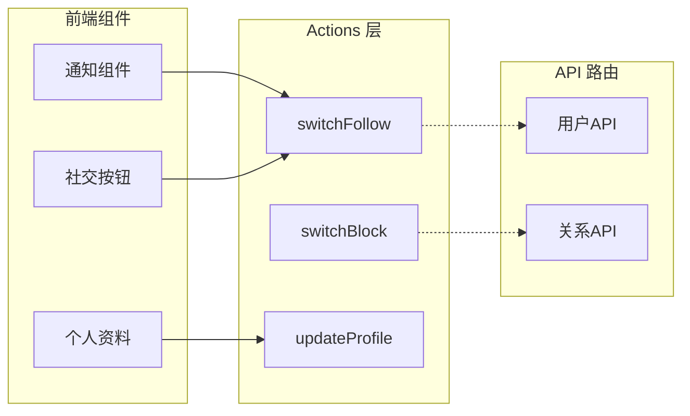

本文档深入分析 Next.js 项目中 Actions 的架构设计与实现模式，探讨服务端 Actions 与客户端交互的完整数据流。

## Actions 架构概述

本项目采用 Next.js 14+ 推荐的 **Server Actions** 模式，将核心业务逻辑部署在服务端，同时保持与客户端的无缝交互。Actions 位于 `src/lib/actions.ts`，承担社交系统中的关键操作：关注/取消关注、封禁/解封、关注请求处理以及用户资料更新等。

### 架构分层图

```mermaid
flowchart TD
    subgraph Client["客户端"]
        UI[UI组件]
        Form[表单数据]
    end
    
    subgraph ServerActions["Server Actions 层"]
        Auth[身份验证<br/>@clerk/nextjs]
        Validation[数据校验<br/>zod]
        DB[数据库操作<br/>Prisma]
    end
    
    subgraph Database["数据库"]
        PrismaDB[(Prisma ORM)]
    end
    
    UI -->|"调用 Actions"| ServerActions
    Form -->|"FormData 传递"| ServerActions
    ServerActions --> Auth
    Auth --> Validation
    Validation --> DB
    DB --> PrismaDB
    
    Cache[Next.js Cache<br/>revalidatePath] -.->|"路径重验证"| UI
```

## 核心 Actions 实现分析

### 1. 关注操作 - switchFollow

`switchFollow` 函数实现了关注/取消关注的双向逻辑，同时处理关注请求的创建与取消：

```typescript
export const switchFollow = async (userId: string) => {
    const authData = await auth();
    const currentUserId = authData.userId;

    if (!currentUserId) {
        throw new Error("User is not authenticated!");
    }

    try {
        const existingFollow = await prisma.follower.findFirst({
            where: {
                followerId: currentUserId,
                followingId: userId,
            },
        });

        if (existingFollow) {
            await prisma.follower.delete({
                where: {
                    id: existingFollow.id,
                },
            });
        } else {
            // 检查是否存在待处理的关注请求
            const existingFollowRequest = await prisma.followRequest.findFirst({
                where: {
                    senderId: currentUserId,
                    receiverId: userId,
                },
            });

            if (existingFollowRequest) {
                await prisma.followRequest.delete({...});
            } else {
                await prisma.followRequest.create({...});
            }
        }
    } catch (err) {
        console.log(err);
        throw new Error("Something went wrong!");
    }
};
```

**关键设计模式**：

| 特性 | 实现方式 |
|------|----------|
| 认证方式 | Clerk `auth()` 异步获取用户ID |
| 错误处理 | try-catch 捕获，抛出统一错误信息 |
| 状态机逻辑 | 三态转换：已关注 → 取消关注 / 未关注 → 发送请求 / 已请求 → 取消请求 |
| 数据一致性 | 先查询再操作，原子性保证 |

Sources: [actions.ts](src/lib/actions.ts#L1-L60)

### 2. 关注请求处理 - accept/decline

关注请求的接受与拒绝实现了对称的操作模式：

```typescript
export const acceptFollowRequest = async (userId: string) => {
    const authData = await auth();
    const currentUserId = authData.userId;

    if (!currentUserId) {
        throw new Error("User is not Authenticated!!");
    }

    try {
        const existingFollowRequest = await prisma.followRequest.findFirst({
            where: {
                senderId: userId,
                receiverId: currentUserId,
            },
        });

        if (existingFollowRequest) {
            await prisma.followRequest.delete({
                where: { id: existingFollowRequest.id },
            });

            await prisma.follower.create({
                data: {
                    followerId: userId,
                    followingId: currentUserId,
                },
            });
        }
    } catch (err) {
        console.log(err);
        throw new Error("Something went wrong!");
    }
};
```

**操作对比表**：

| Action | 数据库操作 | 业务逻辑 |
|--------|------------|----------|
| `acceptFollowRequest` | 删除请求 + 创建关注关系 | 同意关注 |
| `declineFollowRequest` | 仅删除请求 | 拒绝关注 |

Sources: [actions.ts](src/lib/actions.ts#L120-L160)

### 3. 用户资料更新 - updateProfile

该函数展示了带表单验证的复杂数据更新场景：

```typescript
export const updateProfile = async (formData:FormData, cover:string) => {
    const fields = Object.fromEntries(formData);

    const filteredFields = Object.fromEntries(
        Object.entries(fields).filter(([, value]) => value !== "")
    )

    const Profile = z.object({
        cover: z.string().optional(),
        name: z.string().max(60).optional(),
        surname: z.string().max(60).optional(),
        description: z.string().max(255).optional(),
        city: z.string().max(60).optional(),
        school: z.string().max(60).optional(),
        work: z.string().max(60).optional(),
        website: z.string().max(60).optional(),
    });

    const validatedFields = Profile.safeParse({ cover, ...filteredFields });

    if (!validatedFields.success) {
        console.log(validatedFields.error.flatten().fieldErrors);
        return;
    }

    const authData = await auth();
    const userId = authData.userId;

    if (!userId) {
        return;
    }

    try {
        await prisma.user.update({
            where: { id: userId },
            data: validatedFields.data,
        });
    } catch (err) {
        console.log(err);
    }
};
```

**数据流处理**：

```
FormData → Object.fromEntries → 过滤空值 → Zod 验证 → Prisma 更新
                            ↓
                    验证失败: 返回 undefined
                            ↓
                    验证成功: 执行数据库更新
```

Sources: [actions.ts](src/lib/actions.ts#L180-L230)

## 服务端 Actions 调用模式

在客户端调用 Server Actions 时，项目采用以下模式：

### 直接导入调用

客户端组件直接导入 Server Action 并调用：

```typescript
// 客户端组件内
import { updateProfile } from "@/lib/actions";

await updateProfile(formData, coverImage);
```

### 表单action属性

Next.js 支持直接在 `<form action={...}>` 中使用 Server Action：

```typescript
<form action={async () => {
    "use server"
    await updateProfile(formData, cover)
}}>
```

## 认证与安全

所有 Actions 均实现统一的身份验证层：

```typescript
const authData = await auth();
const currentUserId = authData.userId;

if (!currentUserId) {
    throw new Error("User is not authenticated!");
}
```

这种模式确保了：
- **服务端强制验证**：即使客户端绕过检查，服务端仍会拦截
- **审计追踪**：每个操作都可追溯到具体用户
- **最小权限**：Actions 仅执行当前用户授权的操作

Sources: [actions.ts](src/lib/actions.ts#L1-L250)

## 路径重验证配置

虽然当前代码中已导入 `revalidatePath` 但未在函数体内使用，这表明项目预留了缓存更新机制：

```typescript
import { revalidatePath } from "next/cache";
```

在生产环境中，建议在数据变更后添加：

```typescript
revalidatePath(`/profile/${userId}`);
revalidatePath('/friends');
```

## 与其他模块的关系



| 关联模块 | 交互方式 |
|----------|----------|
| [认证系统](6-ren-zheng-xi-tong) | 通过 Clerk 获取用户身份 |
| [数据库设计](7-shu-ju-ku-she-ji) | Prisma ORM 操作 |
| [通知组件](14-sou-suo-yu-tong-zhi-zu-jian) | 关注请求触发通知 |

## 总结与最佳实践

本项目的 Server Actions 设计体现了以下原则：

1. **认证前置**：所有写入操作前进行身份验证
2. **渐进式验证**：使用 Zod 进行数据校验，提供清晰的错误信息
3. **错误边界**：统一的错误处理与抛出机制
4. **类型安全**：TypeScript 完整类型推导，客户端IDE支持友好

建议后续优化方向：
- 添加 `revalidatePath` 调用实现缓存刷新
- 考虑 `useFormStatus` 提供更好的加载状态反馈
- 实施 optimistic updates 优化用户体验