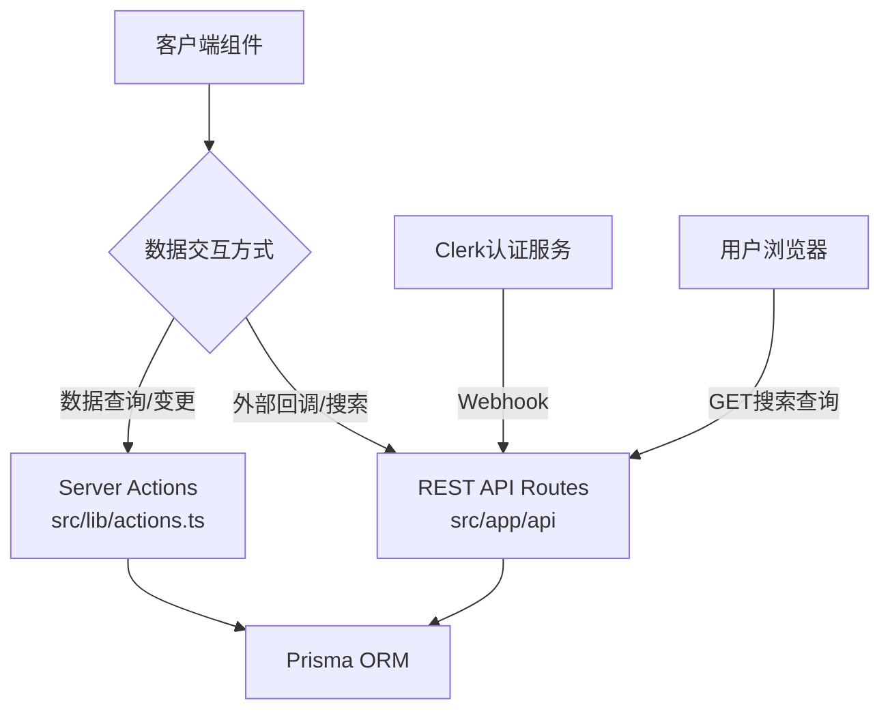
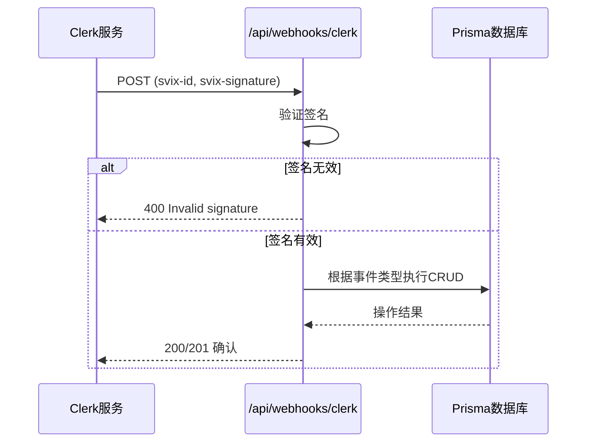

本文档详细介绍该项目中的API路由架构设计。项目采用**Next.js App Router**的现代API设计模式，结合传统RESTful API端点与Server Actions构建完整的全栈数据交互层。

## 架构概览

该项目的API层采用双轨并行策略：



| 路由类型 | 文件位置 | 使用场景 | 通信方式 |
|---------|---------|---------|---------|
| Server Actions | `src/lib/actions.ts` | 关注/屏蔽/发布等用户交互 | 函数调用 |
| REST API | `src/app/api/*` | 搜索、第三方Webhook | HTTP请求 |

Sources: [src/app/api/search/route.ts](src/app/api/search/route.ts#L1-L60), [src/lib/actions.ts](src/lib/actions.ts#L1-L80)

## REST API端点详解

项目在`src/app/api`目录下定义了两个核心REST端点。

### 搜索API

**端点**: `GET /api/search?q={query}`

这是一个全文搜索端点，支持同时检索用户和帖子数据。查询参数`q`需至少2个字符才会执行搜索，避免无意义的空查询。

```typescript
// 核心查询逻辑
const [users, posts] = await Promise.all([
  prisma.user.findMany({
    where: {
      OR: [
        { username: { contains: q } },
        { name: { contains: q } },
        { surname: { contains: q } },
        { description: { contains: q } },
      ],
    },
    take: 5,  // 限制返回数量
  }),
  prisma.post.findMany({
    where: { OR: [{ desc: { contains: q } }] },
    take: 5,
  }),
]);
```

该实现使用Prisma的`contains`操作符进行模糊匹配，并通过`Promise.all`实现用户与帖子的并行查询以优化响应时间。返回结果限制为每次5条记录。

| 参数 | 类型 | 必填 | 说明 |
|-----|------|-----|------|
| q | string | 是 | 搜索关键词，最少2字符 |

Sources: [src/app/api/search/route.ts](src/app/api/search/route.ts#L14-L56)

### Clerk Webhook API

**端点**: `POST /api/webhooks/clerk`

该端点接收来自Clerk身份认证服务的Webhook回调，用于同步用户账户状态。



**支持的Webhook事件**:

| 事件类型 | 操作 | 响应状态码 |
|---------|------|-----------|
| `user.created` | 创建用户记录 | 201 |
| `user.updated` | 更新用户信息 | 200 |
| `user.deleted` | 删除用户记录 | 200 |

该端点强制使用Node.js运行时，因为svix库的某些功能在Edge Runtime中不可用。

```typescript
export const runtime = "nodejs"; // 强制使用 Node.js runtime
```

Sources: [src/app/api/webhooks/clerk/route.ts](src/app/api/webhooks/clerk/route.ts#L1-L96)

## Server Actions架构

项目核心业务逻辑通过Server Actions实现，这种方式无需手动创建API端点即可从客户端调用服务端逻辑。

### 关注/屏蔽功能

`src/lib/actions.ts`中定义了社交核心操作：

**`switchFollow(userId: string)`** — 切换关注状态
- 若已关注则取消关注
- 若已发送关注请求则撤回
- 否则发送新的关注请求

**`switchBlock(userId: string)`** — 切换屏蔽状态
- 若已屏蔽则取消屏蔽
- 否则添加屏蔽记录

这些Actions均包含身份验证检查：

```typescript
const authData = await auth();
const currentUserId = authData.userId;

if (!currentUserId) {
    throw new Error("User is not authenticated!");
}
```

Sources: [src/lib/actions.ts](src/lib/actions.ts#L9-L58), [src/lib/actions.ts](src/lib/actions.ts#L60-L80)

## 设计模式总结

| 特性 | REST API | Server Actions |
|-----|----------|---------------|
| 适用场景 | 外部系统集成、搜索查询 | 用户交互操作 |
| 调用方式 | HTTP请求 | TypeScript函数调用 |
| 类型安全 | 手动定义 | 自动类型推断 |
| 状态管理 | 无状态 | 可直接访问服务端资源 |
| 缓存策略 | 需手动配置 | 支持`revalidatePath` |

该设计遵循**最小权限**和**关注点分离**原则：搜索等只读操作通过REST API暴露以便于前端直接调用；而涉及状态变更的核心业务则通过Server Actions封装，确保数据操作的原子性和安全性。

## 相关文档

- [中间件机制](17-zhong-jian-jian-ji-zhi) — 了解请求拦截与认证流程
- [数据序列化](18-shu-ju-xu-lie-hua) — 查看前后端数据转换方案
- [客户端与服务端Actions](15-ke-hu-duan-yu-fu-wu-duan-actions) — 深入了解Server Actions使用模式