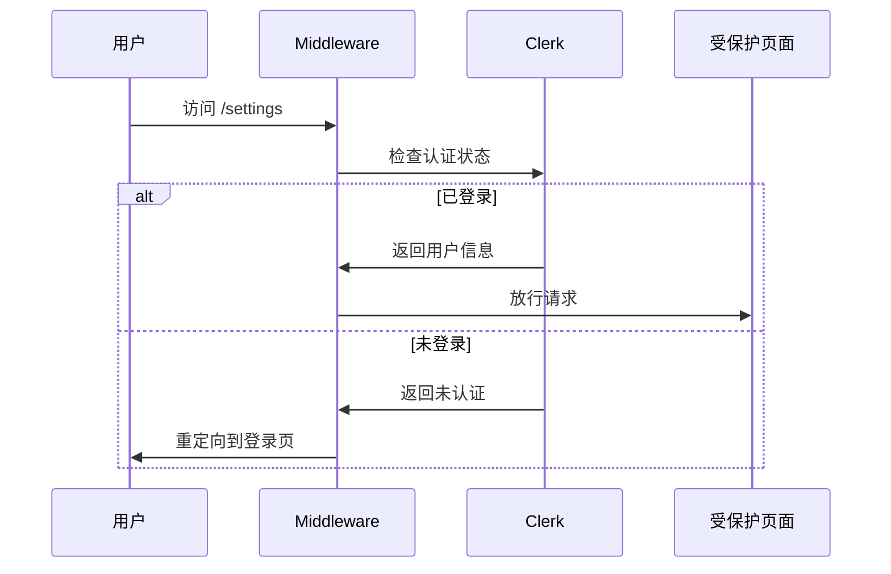

## 概述

中间件机制是 Next.js 应用架构中的核心安全层，负责在请求到达页面或 API 之前执行身份验证、路径匹配和访问控制逻辑。本项目的中间件基于 **Clerk** 认证平台实现，为应用提供细粒度的路由保护能力。

## 架构设计

### 中间件工作流程

```mermaid
flowchart TD
    A[用户请求] --> B{matcher 配置过滤}
    B -->|静态资源/_next| C[跳过中间件]
    B -->|有效路由| D[执行 clerkMiddleware]
    D --> E{路由匹配检查}
    E -->|受保护路由| F[auth().protect()]
    E -->|公开路由| G[放行]
    F --> H{认证状态}
    H -->|已登录| G
    H -->|未登录| I[重定向到登录页]
    G --> J[处理请求]
    I --> K[ Clerk 登录页面]
    
    style F fill:#f9f,stroke:#333
    style I fill:#ff9,stroke:#333
```

### 路由保护配置

项目中间件采用**声明式路由匹配**模式，通过 `createRouteMatcher` 定义受保护路径：

| 配置项 | 匹配路径 | 保护级别 |
|--------|----------|----------|
| `"/settings(.*)"` | `/settings` 及其所有子路径 | ✅ 必须登录 |
| `"/"` | 应用首页 | ✅ 必须登录 |

Sources: [middleware.ts](src/middleware.ts#L5-L8)

## 实现细节

### 核心代码结构

```typescript
// 1. 定义路由匹配器
const isProtectedRoute = createRouteMatcher([
    "/settings(.*)",
    "/",
]);

// 2. 中间件执行函数
export default clerkMiddleware(async (auth, req) => {
    if (isProtectedRoute(req)) {
        await auth().protect(); // 保护逻辑
    }
});

// 3. Matcher 配置
export const config = {
    matcher: [
        "/((?!_next|favicon.ico|.*\\..*).*)",  // 排除静态资源
        "/(api|trpc)(.*)",                      // 包含所有 API 路径
    ],
};
```

Sources: [middleware.ts](src/middleware.ts#L10-L24)

### 请求过滤机制

中间件的 `matcher` 配置实现了两层过滤：

1. **排除规则** `"/((?!_next|favicon.ico|.*\\..*).*)"`
   - `_next`: Next.js 内部路由
   - `favicon.ico`: 网站图标
   - `.*\\..*`: 带文件扩展名的静态资源

2. **包含规则** `"/(api|trpc)(.*)"`
   - 所有 API 路由必须经过中间件
   - 确保 API 层面的认证检查

Sources: [middleware.ts](src/middleware.ts#L18-L23)

## 安全特性

### 认证流程



### Clerk 认证集成优势

| 特性 | 说明 |
|------|------|
| **零信任模型** | 默认拒绝所有受保护路由 |
| **自动重定向** | 未认证用户自动跳转登录页 |
| **异步保护** | 支持 async/await 模式，符合 Clerk v5 规范 |
| **细粒度控制** | 支持通配符匹配子路径 |

Sources: [middleware.ts](src/middleware.ts#L10-L14)

## 配置扩展

### 添加新的受保护路由

在 `createRouteMatcher` 数组中添加新路径：

```typescript
const isProtectedRoute = createRouteMatcher([
    "/settings(.*)",
    "/",
    "/profile(.*)",      // 新增：个人资料页
    "/messages(.*)",     // 新增：消息页
]);
```

### 修改 Matcher 行为

| 场景 | 修改建议 |
|------|----------|
| 排除特定 API | 修改 matcher 正则表达式 |
| 添加白名单 | 在 matcher 中添加 `!/api/public(.*)` 模式 |
| 启用 SSR 完整检查 | 配合 `auth.protect()` 使用 |

## 相关文档

- [认证系统](6-ren-zheng-xi-tong) — 了解完整的 Clerk 集成架构
- [API路由设计](16-apilu-you-she-ji) — 查看 API 层面的保护机制
- [项目结构解析](4-xiang-mu-jie-gou-jie-xi) — 探索中间件在项目中的位置