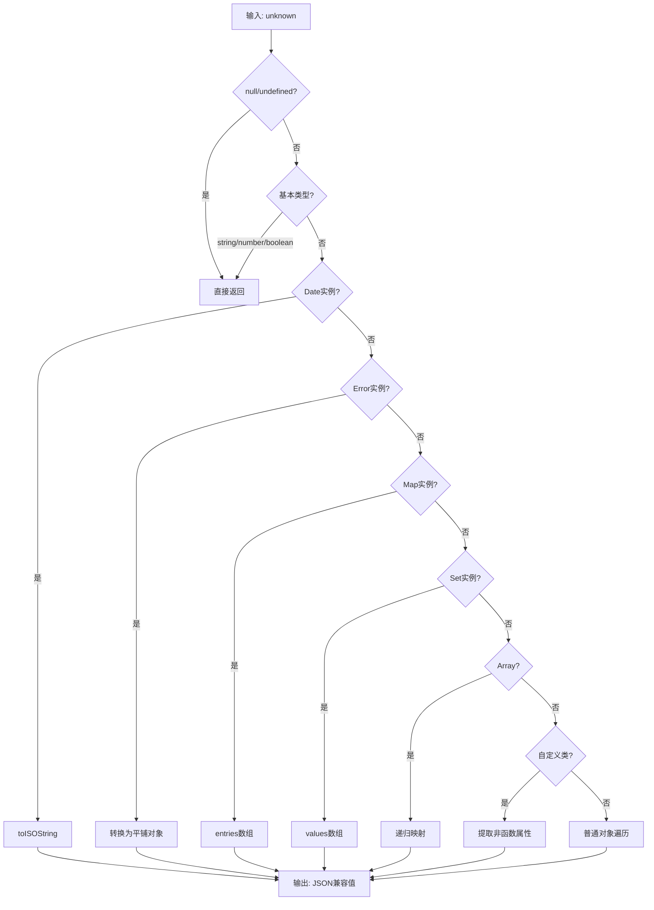

在 Next.js 应用中，服务端与客户端之间的数据传递需要特别处理。Prisma 查询返回的数据包含大量无法被 JSON 序列化的对象（如 Date、Error、Map、Set 等），直接传递会导致序列化错误。本章节详细解析项目中的数据序列化机制。

## 序列化函数架构

项目中实现了一个通用的 `serializeForClient` 函数，位于 [src/lib/serializeForClient.ts](src/lib/serializeForClient.ts#L1-L60)。该函数采用递归遍历策略，将各种复杂数据类型转换为可序列化的纯 JavaScript 对象。



## 支持的数据类型转换

| 源数据类型 | 序列化结果 | 说明 |
|-----------|-----------|------|
| `null` / `undefined` | 原值返回 | 保持一致性 |
| `string` / `number` / `boolean` | 原值返回 | 基本类型直接传递 |
| `Date` | ISO 8601 字符串 | `toISOString()` 转换 |
| `Error` | `{__type:"Error", name, message, stack}` | 保留错误信息结构 |
| `Map` | `{__type:"Map", entries: [key, value][]}` | 递归序列化键值对 |
| `Set` | `{__type:"Set", values: any[]}` | 递归序列化每个元素 |
| `Array` | 递归映射的新数组 | 逐元素处理 |
| 自定义类实例 | 平铺对象 + `__class` 标记 | 排除函数属性，记录类名 |
| 普通对象 | 键值对递归转换 | 深度遍历 |

Sources: [src/lib/serializeForClient.ts](src/lib/serializeForClient.ts#L1-L60)

## 实际应用场景

在 [src/lib/actions.ts](src/lib/actions.ts#L1-L10) 中，序列化函数被导入并在服务端 Action 中使用。当需要返回数据库查询结果给客户端时，必须使用该函数进行转换。

```typescript
// src/lib/actions.ts
import { serializeForClient } from "./serializeForClient";
```

序列化在以下场景尤为重要：
- **用户资料查询**：Prisma 返回的 User 对象包含 Date 类型的 `createdAt` 字段
- **关注关系数据**：Follower/Following 记录的时间戳需要序列化
- **错误处理**：服务端捕获的 Error 对象需要传递到客户端显示

Sources: [src/lib/serializeForClient.ts](src/lib/serializeForClient.ts#L1-L60)

## 自定义类处理机制

对于非 Object.prototype 的自定义类实例，序列化函数通过以下逻辑处理：

1. 获取对象原型链：`Object.getPrototypeOf(value)`
2. 排除函数类型属性：只保留数据字段
3. 添加 `__class` 标记：记录构造函数名称，便于客户端辨识

```typescript
// 自定义类检测逻辑
const proto = Object.getPrototypeOf(value);
if (proto && proto !== Object.prototype) {
    // 提取非函数属性
    for (const key of Object.keys(value as Record<string, unknown>)) {
        const v = (value as Record<string, unknown>)[key];
        if (typeof v !== "function") plain[key] = serializeForClient(v);
    }
    // 标记类名
    plain.__class = value.constructor?.name;
    return plain;
}
```

这种设计允许客户端在接收数据后，通过 `__class` 字段识别原始类型并进行相应处理。

## 与 Next.js 的协同

数据序列化是 Next.js App Router 架构中的关键环节。服务端组件或 Server Action 返回数据时，Next.js 内部会进行 JSON 序列化，但对于上述复杂类型会抛出错误。`serializeForClient` 函数在数据离开服务端之前完成预处理，确保整个数据通道的兼容性。

## 延伸阅读

- [客户端与服务端Actions](15-ke-hu-duan-yu-fu-wu-duan-actions) — 了解 Server Action 的数据流转
- [API路由设计](16-apilu-you-she-ji) — 探索 API 层面的数据处理
- [数据库设计](7-shu-ju-ku-she-ji) — 理解 Prisma 模型与数据类型