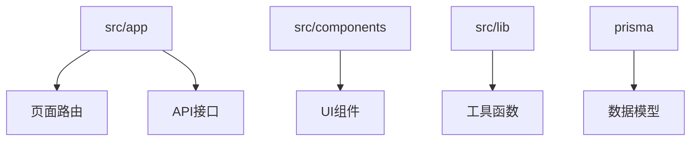

欢迎踏上 Next.js 全栈社交应用开发之旅！本文档将指引你从零开始搭建开发环境，运行项目，并理解核心架构。无论你是前端新手还是经验丰富的开发者，这篇指南都将帮助你快速上手本项目。

## 项目概览

本项目是一个功能完整的社交网络平台，集成了动态帖子发布、即时消息、好友系统、八字计算器等特色功能。技术栈采用现代主流方案：Next.js 15 配合 App Router，TypeScript 提供类型安全，Prisma 驱动 MySQL 数据库，Clerk 处理身份认证，整体采用 Tailwind CSS 构建响应式界面。

## 前置准备

在开始之前，请确保你的开发环境满足以下要求：

| 工具 | 最低版本 | 说明 |
|------|----------|------|
| Node.js | 18.17+ | Next.js 15 需要较新版 Node |
| npm / yarn / pnpm | 最新稳定版 | 包管理工具 |
| MySQL | 8.0+ | 本地或远程数据库 |
| Git | 2.30+ | 版本控制 |

## 环境配置步骤

### 1. 克隆项目与依赖安装

打开终端，执行以下命令获取项目代码并安装依赖：

```bash
git clone <你的仓库地址>
cd nextjs-typescript-test
npm install
```

npm install 命令将根据 package.json 中的依赖声明自动安装所有必需包，包括 Next.js 核心库、Prisma ORM、Clerk 认证组件等。

Sources: [package.json](package.json#L1-L36)

### 2. 数据库配置

本项目使用 Prisma 作为 ORM 框架，连接 MySQL 数据库。首先需要在项目根目录创建 .env 文件配置数据库连接：

```env
DATABASE_URL="mysql://用户名:密码@localhost:3306/数据库名"
```

配置完成后，执行以下命令初始化 Prisma Client 并同步数据库架构：

```bash
npx prisma generate
npx prisma db push
```

npx prisma generate 根据 schema.prisma 文件生成 TypeScript 类型的数据库客户端，而 npx prisma db push 将模型定义同步到实际数据库创建表结构。

Sources: [prisma/schema.prisma](prisma/schema-prisma#L1-L20)

数据库模型定义了核心实体：User（用户）、Post（帖子）、Comment（评论）、Like（点赞）、Follower（粉丝）、Message（消息）等，每个模型都配置了级联删除确保数据一致性。

### 3. 启动开发服务器

一切配置就绪后，运行以下命令启动开发服务器：

```bash
npm run dev
```

默认情况下，服务器将在 http://localhost:3000 启动。打开浏览器访问该地址，如果一切正常，你应该能看到项目的主页面。

Sources: [package.json](package-json#L5)

## 项目架构解读

理解项目结构是深入开发的前提。本项目采用 Next.js App Router 架构，以下是核心目录说明：



| 目录 | 职责 |
|------|------|
| src/app | Next.js 15 路由系统，包含页面和 API 端点 |
| src/components | 可复用 React 组件，如导航栏、聊天窗口 |
| src/lib | 工具函数、Prisma 客户端、Actions |
| prisma | 数据库模型定义与迁移 |

## 核心功能模块概览

本项目实现了丰富的社交功能，主要包括：

| 功能模块 | 技术实现 | 数据模型 |
|----------|----------|----------|
| 用户认证 | Clerk | User |
| 动态帖子 | Server Actions + API | Post, Comment, Like |
| 即时消息 | WebSocket/SWR | Conversation, Message |
| 好友系统 | Follow 关系 | Follower, FollowRequest |
| 八字计算 | lunar-javascript | 独立计算组件 |

Sources: [prisma/schema.prisma](prisma/schema-prisma#L22-L141)

## 常见问题排查

**问题：npm install 失败**
检查 Node.js 版本是否满足 18.17+ 要求，可使用 node -v 查看当前版本。

**问题：数据库连接失败**
确认 MySQL 服务已启动，且 .env 中的 DATABASE_URL 格式正确。

**问题：Prisma 请求报错**
确保已执行 npx prisma generate 生成客户端，且数据库已创建对应表。

## 下一步学习路径

完成快速开始后，建议按以下顺序深入学习：

1. 先阅读 [项目概述](1-xiang-mu-gai-shu) 了解整体设计思想
2. 学习 [技术栈介绍](3-ji-zhu-zhan-jie-shao) 深入理解各技术特性
3. 探索 [项目结构解析](4-xiang-mu-jie-gou-jie-xi) 掌握目录组织
4. 实践 [认证系统](6-ren-zheng-xi-tong) 理解 Clerk 集成
5. 深入 [数据库设计](7-shu-ju-ku-she-ji) 学习数据建模

祝你开发顺利！如有疑问请参考官方文档或提交 Issue 到项目仓库。