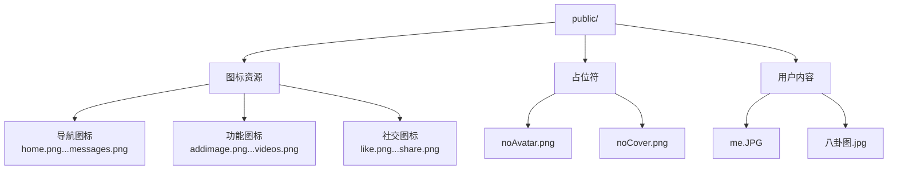

本页面介绍 Next.js 项目中图像与媒体资源的管理策略，涵盖静态资源组织、Next.js Image 组件配置、外部图像源集成等内容。

## 静态资源目录结构

本项目的静态资源存放于 `public/` 目录，该目录中的文件可直接通过根路径 `/` 访问。项目静态资源按功能分为以下几类：

| 资源类型 | 文件示例 | 用途说明 |
|---------|---------|---------|
| 导航图标 | home.png, messages.png, friends.png | 顶部导航栏和侧边菜单图标 |
| 功能图标 | addimage.png, videos.png, polls.png | 发帖、媒体、投票等功能按钮 |
| 社交图标 | like.png, comment.png, share.png | 动态互动操作按钮 |
| 占位图像 | noAvatar.png, noCover.png | 用户无头像/封面时的默认显示 |
| 用户内容 | me.JPG, 八卦图.jpg | 测试用用户图片资源 |



Sources: [next.config.ts](next.config.ts#L1-L28)

## Next.js 图像优化配置

项目在 `next.config.ts` 中配置了 `images` 选项，定义了允许加载的外部远程图像域名。这是 Next.js Image 组件安全策略的重要组成部分：

```typescript
images: {
    remotePatterns: [
        {
            protocol: "https",
            hostname: "images.pexels.com",
        },
        {
            protocol: "https",
            hostname: "img.clerk.com",
        },
        {
            protocol: "https",
            hostname: "res.cloudinary.com",
        },
    ],
},
```

| 配置参数 | 值 | 说明 |
|---------|-----|------|
| protocol | https | 仅允许 HTTPS 协议 |
| images.pexels.com | 免费图库 | 测试用外部图像源 |
| img.clerk.com | Clerk 认证服务 | 用户头像托管 |
| res.cloudinary.com | Cloudinary CDN | 动态图像处理 |

Sources: [next.config.ts](next.config.ts#L10-L23)

## 图像使用模式

### 直接引用方式

项目中的图像主要通过两种方式使用：

1. **直接 img 标签引用**：适用于简单场景
   ```tsx
   
   ```

2. **Next.js Image 组件**：适用于需要优化的场景
   ```tsx
   import Image from 'next/image';
   <Image src="/me.JPG" alt="用户头像" width={100} height={100} />
   ```

### 占位符机制

项目中实现了占位符模式，当用户未上传头像或封面时显示默认图像：

- `noAvatar.png` — 用户默认头像
- `noCover.png` — 页面默认封面图

这种设计确保了 UI 的一致性，避免图像加载失败时的布局错乱。

Sources: [next.config.ts](next.config.ts#L1-L28)

## 媒体资源管理最佳实践

基于本项目的实现模式，建议遵循以下图像资源管理规范：

| 最佳实践 | 说明 |
|---------|------|
| 静态资源放 public/ | 需要直接通过 URL 访问的图像存放于此 |
| 外部域配置 | 在 next.config.ts 中预配置可信的外部图像源 |
| 占位符设计 | 为所有用户生成内容设置默认占位图像 |
| 合理选择格式 | PNG 适用于图标，JPG 适用于照片 |
| Image 组件优先 | 优先使用 next/image 以获得自动优化 |

## 相关资源

- 了解更多 Next.js 图像优化：[Next.js Image 官方文档](https://nextjs.org/docs/app/api-reference/components/image)
- 配置参考：[next.config.ts](next.config.ts) 完整配置
- 组件系统概述：[组件系统概述](12-zu-jian-xi-tong-gai-shu)
- 了解样式系统：[Tailwind CSS 样式系统](19-tailwind-cssyang-shi-xi-tong)

---

**阅读建议**：建议配合 [组件系统概述](12-zu-jian-xi-tong-gai-shu) 了解图像组件的具体实现方式，再通过 [Tailwind CSS 样式系统](19-tailwind-cssyang-shi-xi-tong) 掌握图像样式设计。