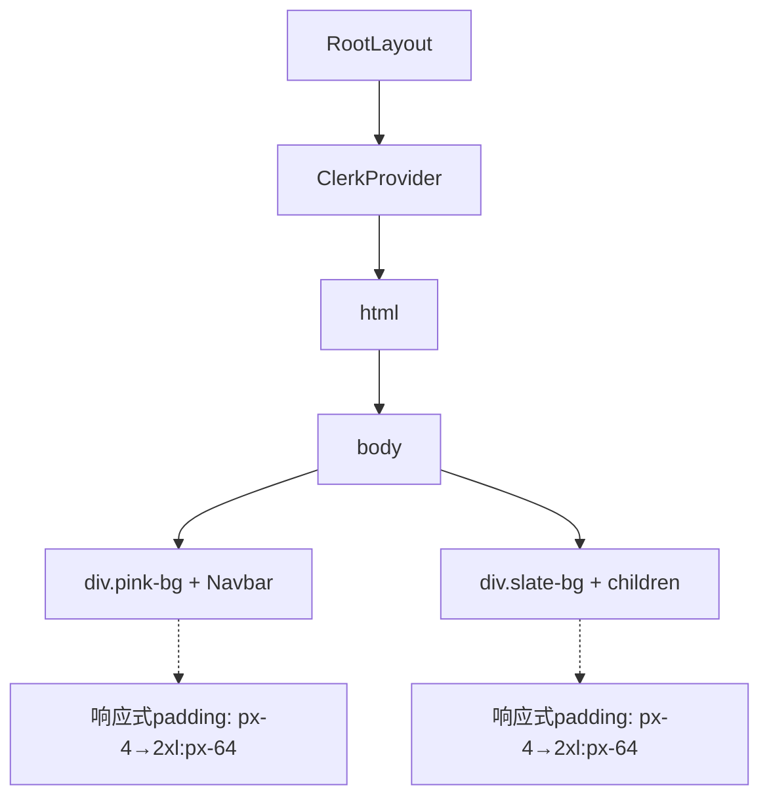
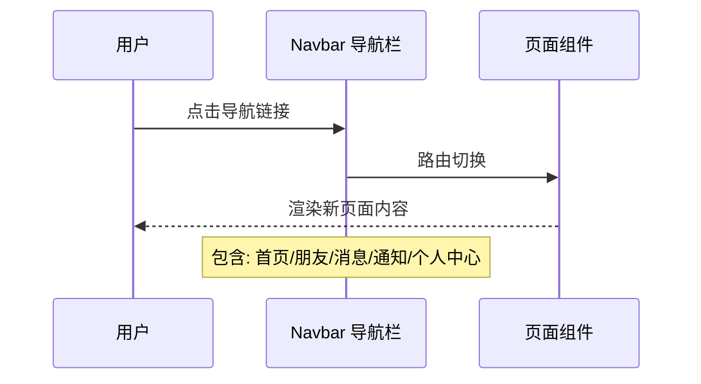

本文档详细介绍 Next.js 项目中的**路由系统架构**与**布局(Layout)设计模式**，这是构建多页面社交应用的核心基础设施。

## 路由架构概览

本项目采用 Next.js App Router 架构，所有路由均位于 `src/app` 目录中，通过文件系统路径直接映射为 URL 路由。

### 路由结构图

```mermaid
graph TD
    A[src/app] --> B[根路由 /]
    A --> C[/friends]
    A --> D[/messages/[receiverId]]
    A --> E[/profile/[username]]
    A --> F[/settings]
    A --> G[/tools/bazi]
    A --> H[/sign-in]
    A --> I[/sign-up]
    
    B --> J[Home 动态信息流]
    C --> K[朋友列表与管理]
    D --> L[私聊窗口]
    E --> M[用户资料页]
    F --> N[账户设置]
    G --> O[八字计算器]
    H --> P[Clerk 登录]
    I --> Q[Clerk 注册]
```

### 路由清单

| 路由路径 | 文件位置 | 路由类型 | 功能说明 |
|---------|---------|---------|---------|
| `/` | `page.tsx` | 静态 | 首页/动态信息流 |
| `/friends` | `friends/page.tsx` | 静态 | 朋友列表页面 |
| `/messages/[receiverId]` | `messages/[receiverId]/page.tsx` | 动态 | 私聊页面，接收 receiverId 参数 |
| `/profile/[username]` | `profile/[username]/page.tsx` | 动态 | 用户资料页，接收 username 参数 |
| `/settings` | `settings/page.tsx` | 静态 | 设置页面 |
| `/tools/bazi` | `tools/bazi/page.tsx` | 静态 | 八字计算工具 |
| `/sign-in` | `sign-in/[[...sign-in]]/page.tsx` | 全捕获 | Clerk 登录认证 |
| `/sign-up` | `sign-up/[[...sign-up]]/page.tsx` | 全捕获 | Clerk 注册认证 |

Sources: [get_dir_structure](src/app)

## 根布局设计 (Root Layout)

根布局文件 `src/app/layout.tsx` 定义了全局通用的 UI 结构，所有页面共享此布局。

### 布局架构



### 关键实现

根布局包含以下核心组件：

```typescript
// src/app/layout.tsx (行 14-32)
<ClerkProvider>
  <html lang="en">
    <body className={inder.className}>
      {/* 顶部导航区 - 粉色调 */}
      <div className="w-full bg-pink-100 px-4 md:px-8 lg:px-16 xl:px-32 2xl:px-64">
        <Navbar/>
      </div>
      {/* 主内容区 - 浅灰色 */}
      <div className="bg-slate-100 px-4 md:px-8 lg:px-16 xl:px-32 2xl:px-64">
        {children}
      </div>
    </body>
  </html>
</ClerkProvider>
```

**设计要点**：

- **ClerkProvider**: 包裹整个应用，提供完整的认证上下文，包括用户登录状态管理
- **响应式布局**: 使用 Tailwind 响应式断点（`md`、`lg`、`xl`、`2xl`）实现多端适配
- **颜色分区**: 顶部导航区使用 `bg-pink-100`，主内容区使用 `bg-slate-100`，形成视觉层次
- **字体配置**: 加载 Google Fonts 的 Inder 字体，应用至全局 body

Sources: [src/app/layout.tsx](src/app/layout.tsx#L14-L32)

## 动态路由模式

项目中有两处使用**动态路由参数**来实现复用页面组件：

### 消息路由 `/messages/[receiverId]`

当访问 `/messages/123` 时，`receiverId` 参数值为 `"123"`，用于确定与哪个用户进行私聊。

### 用户资料路由 `/profile/[username]`

当访问 `/profile/john` 时，`username` 参数值为 `"john"`，用于加载对应用户的资料数据。

这种模式允许使用单个页面组件处理无限数量的用户特定内容，避免为每个用户创建独立路由文件。

## 嵌套布局与路由组

项目采用扁平化路由结构，除根布局外未使用额外的 `layout.tsx` 文件进行嵌套。这种设计适用于中小型应用，便于维护。

对于大型项目，可通过以下方式扩展：

| 扩展方式 | 适用场景 | 示例 |
|---------|---------|------|
| 路由组 `(group)` | 组织相关页面，共享布局但不影响 URL | `(dashboard)/layout.tsx` |
| 嵌套布局 | 特定路径区段共享 UI | `app/dashboard/layout.tsx` |
| 并行路由 `(@folder)` | 同时渲染多个页面区域 | `app/@modal/page.tsx` |

## 路由导航流程

用户在本应用中的典型导航路径：



导航组件 `Navbar` 位于根布局中，确保用户在浏览任意页面时都能快速切换 sections。

## 相关文档导航

- 深入了解核心功能模块 → [八字计算器](8-ba-zi-ji-suan-qi)（对应 `/tools/bazi` 路由）
- 前端导航实现 → [导航与菜单组件](13-dao-hang-yu-cai-dan-zu-jian)
- 认证系统集成 → [认证系统](6-ren-zheng-xi-tong)（涉及 `/sign-in`、`/sign-up` 路由）
- 消息功能 → [消息功能](10-xiao-xi-gong-neng)（对应 `/messages` 路由）