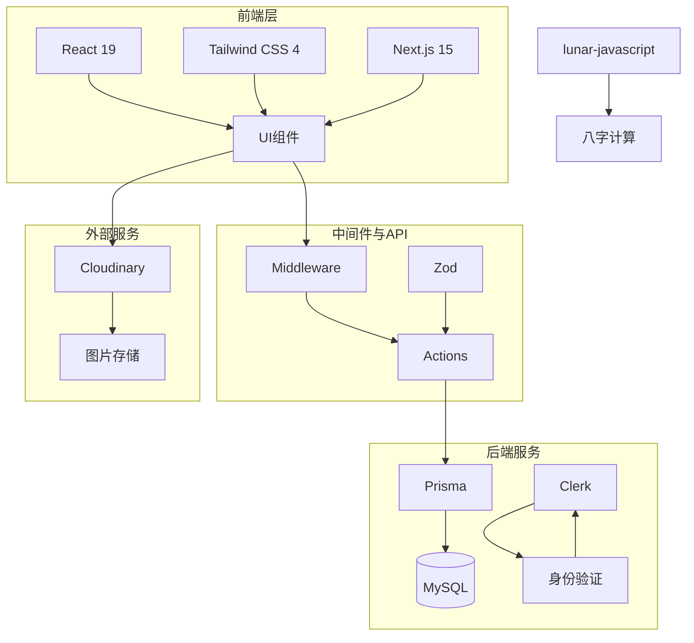

本文档详细介绍本项目所采用的核心技术栈，包括前端框架、后端数据库、认证系统等关键组件，帮助开发者快速理解项目的技术架构。

## 技术架构概览

本项目采用**Next.js 15**作为全栈框架，结合**React 19**构建用户界面，后端使用**MySQL**数据库配合**Prisma** ORM进行数据管理，认证系统则集成**Clerk**服务。整个技术选型兼顾开发效率与性能表现。



Sources: [package.json](package.json#L1-L36)

## 核心技术栈详解

### Next.js 15 全栈框架

项目基于**Next.js 15.5.4**构建，充分利用其App Router架构带来的服务端渲染（SSR）与客户端交互能力。Next.js 15引入了Turbopack作为默认开发服务器，大幅提升构建速度。

```json
"next": "15.5.4",
"react": "19.1.0",
"react-dom": "19.1.0"
```

通过Next.js的App Router，项目实现了：
- **服务端组件**：用于数据获取和不可交互的UI渲染
- **客户端组件**：用于需要用户交互的功能
- **API Routes**：处理后端业务逻辑
- **Middleware**：请求拦截与认证验证

Sources: [package.json](package.json#L1-L36)

### TypeScript 类型安全

项目完全采用**TypeScript**进行开发，通过静态类型检查减少运行时错误，提升代码质量和可维护性。tsconfig.json中配置了严格的类型检查规则。

Sources: [package.json](package.json#L35)

### 数据库与ORM

**MySQL**作为关系型数据库，配合**Prisma 6.16.2**作为ORM框架，提供类型安全的数据库操作。Prisma schema定义了完整的数据模型，包括用户、帖子、评论、点赞、关注关系等。

```prisma
datasource db {
  provider = "mysql"
  url      = env("DATABASE_URL")
}
```

项目的数据模型设计涵盖：
- **用户系统**：个人资料、头像、封面图
- **内容发布**：帖子、评论、图片
- **社交互动**：点赞、关注、粉丝、屏蔽
- **消息系统**：会话、消息记录、已读状态
- **故事功能**：限时动态

Sources: [prisma/schema.prisma](prisma/schema.prisma#L1-L141)

### 认证系统 Clerk

项目集成**Clerk (@clerk/nextjs ^5.7.5)**作为认证解决方案，提供完整的用户注册、登录、会话管理功能。Clerk支持多种登录方式，包括邮箱密码、社交账号登录等。

```json
"@clerk/nextjs": "^5.7.5",
"clerk": "^0.8.3"
```

Sources: [package.json](package.json#L8-L9)

### 表单验证 Zod

**Zod (^4.1.12)**用于服务端数据验证，确保API接收的数据符合预期格式。相比传统的验证库，Zod提供更好的TypeScript支持。

```json
"zod": "^4.1.12"
```

Sources: [package.json](package.json#L15)

### 样式系统 Tailwind CSS

**Tailwind CSS 4**作为项目的主要样式解决方案，配合**@tailwindcss/postcss**插件提供原子化CSS类。项目通过Tailwind实现响应式设计和主题定制。

```json
"tailwindcss": "^4",
"@tailwindcss/postcss": "^4"
```

Sources: [package.json](package.json#L27-L30)

### 图片与媒体资源

项目使用**next-cloudinary**集成Cloudinary服务，实现图片上传、存储和CDN加速。同时在next.config.ts中配置了远程图片域名白名单：

- images.pexels.com（免费图库）
- img.clerk.com（Clerk用户头像）
- res.cloudinary.com（Cloudinary资源）

Sources: [next.config.ts](next.config.ts#L1-L28)

### 业务逻辑扩展

**lunar-javascript**库用于实现中国传统的八字计算功能，这是一个传统历法JavaScript库，支持、农历日期转换和八字排盘。

```json
"lunar-javascript": "^1.7.7"
```

Sources: [package.json](package.json#L14)

## 技术栈对比

| 技术领域 | 选用方案 | 备选方案 | 选择理由 |
|---------|----------|----------|----------|
| 框架 | Next.js 15 | Remix, Gatsby | App Router优秀，生态成熟 |
| 数据库 | MySQL | PostgreSQL, MongoDB | 关系型数据更适合社交场景 |
| ORM | Prisma | Drizzle, TypeORM | 类型安全，开发体验好 |
| 认证 | Clerk | NextAuth, Supabase | 开箱即用，易于集成 |
| 样式 | Tailwind CSS | CSS Modules, Styled | 原子化类名，响应式便捷 |
| 验证 | Zod | Yup, Joi | TypeScript原生支持 |

## 开发工具链

项目配置了完整的开发工具链：

- **ESLint** (^9)：代码质量检查
- **TypeScript** (^5)：类型检查
- **Prettier**：代码格式化（如配置）
- **Turbopack**：快速开发服务器

Sources: [package.json](package.json#L27-L36)

## 项目配置要点

开发者在环境配置时需要注意：

1. **数据库连接**：在`.env`中配置`DATABASE_URL`指向MySQL数据库
2. **Clerk密钥**：配置`CLERK_PUBLISHABLE_KEY`和`CLERK_SECRET_KEY`
3. **Cloudinary**：配置云端图片上传的API密钥

Sources: [next.config.ts](next.config.ts#L1-L28)

## 后续学习建议

完成本章节后，建议继续学习：

- **[项目结构解析](4-xiang-mu-jie-gou-jie-xi)**：深入了解各目录的职责划分
- **[环境配置与依赖](5-huan-jing-pei-zhi-yu-yi-lai)**：配置开发环境
- **[认证系统](6-ren-zheng-xi-tong)**：了解Clerk认证集成细节
- **[数据库设计](7-shu-ju-ku-she-xi)**：深入学习数据模型设计