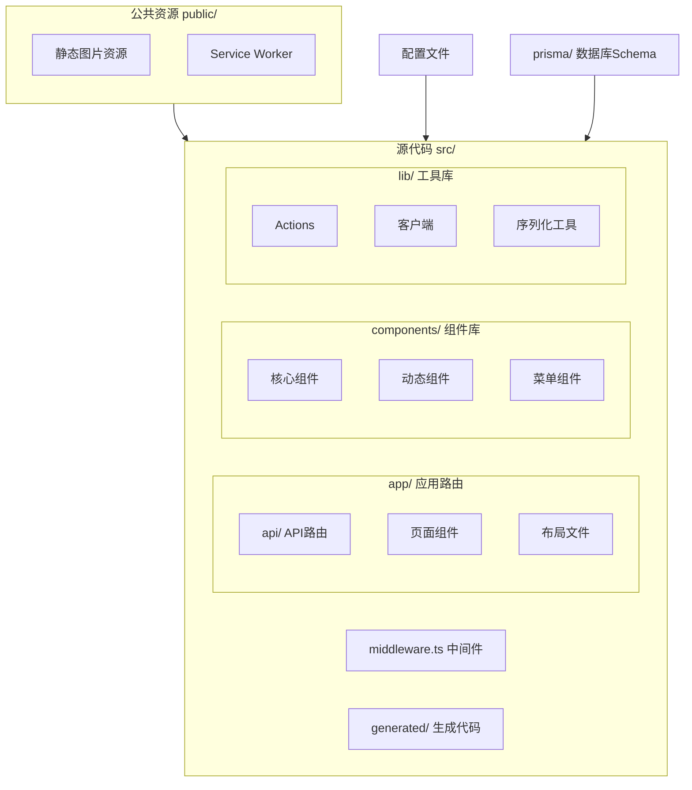

本文档详细解析 Next.js TypeScript 社交项目的目录结构与架构设计，帮助开发者理解各目录的职责划分与代码组织逻辑。

## 项目整体架构

本项目采用 **Next.js 15 App Router** 架构，构建一个类似社交平台的 Web 应用。核心技术栈包括 Next.js 15、React 19、TypeScript、Prisma ORM、Clerk 认证以及 Tailwind CSS 样式系统。



## 根目录配置文件

项目根目录包含核心配置文件，定义构建脚本、开发依赖和框架行为。

| 文件 | 作用 |
|------|------|
| `package.json` | 项目依赖管理与脚本命令定义 |
| `next.config.ts` | Next.js 构建配置 |
| `tsconfig.json` | TypeScript 编译选项 |
| `eslint.config.mjs` | ESLint 代码规范配置 |
| `postcss.config.mjs` | PostCSS 样式处理配置 |
| `prisma/schema.prisma` | 数据库模型定义 |

`package.json` 定义了项目的核心依赖，包括 Next.js 15.5.4、React 19.1.0、Prisma 6.16.2 以及 Clerk 认证库。构建脚本使用 `--turbopack` 标志启用 Turbopack 加速开发模式。

 Sources: [package.json](package.json#L1-L36)

`tsconfig.json` 配置路径别名 `@/*` 指向 `./src/*`，方便在代码中使用 `@/components` 这样的导入路径。同时排除了 `src/generated` 目录，避免类型生成文件干扰编译。

 Sources: [tsconfig.json](tsconfig.json#L1-L28)

## 源代码目录结构

### 应用路由 app/

`app/` 目录采用 Next.js 15 App Router 架构，每个子目录对应一个路由节点。

```
app/
├── api/              # API 路由
├── friends/          # 朋友功能页面
├── messages/         # 消息功能页面
├── profile/          # 个人资料页面
├── settings/         # 设置页面
├── sign-in/          # 登录页面
├── sign-up/          # 注册页面
├── tools/            # 工具页面（如八字计算器）
├── globals.css       # 全局样式
├── layout.tsx        # 根布局
└── page.tsx          # 首页
```

路由设计遵循功能模块化原则，将认证相关页面（sign-in、sign-up）、核心功能页面（friends、messages、profile）与工具页面分离。App Router 的布局系统通过 `layout.tsx` 为所有页面提供统一的导航栏、菜单栏和响应式容器。

### 组件目录 components/

组件按功能类型分目录组织，便于职责划分与代码维护。

```
components/
├── AddPost.tsx           # 添加帖子组件
├── AddPostButton.tsx     # 添加帖子按钮
├── BaziCalculator.tsx    # 八字计算器组件
├── Chat.tsx              # 聊天组件
├── MobileMenu.tsx        # 移动端菜单
├── Navbar.tsx            # 导航栏
├── Notifications.tsx     # 通知组件
├── Search.tsx            # 搜索组件
├── Tools.tsx             # 工具组件
├── feed/                 # 动态信息流相关组件
├── leftMenu/             # 左侧菜单组件
└── rightMenu/            # 右侧菜单组件
```

组件设计遵循单一职责原则，例如 `AddPost.tsx` 负责帖子创建表单，而 `AddPostButton.tsx` 仅处理触发按钮的交互。信息流、菜单等复杂功能模块独立成子目录，保持主目录的简洁性。

### 工具库 lib/

`lib/` 目录包含应用核心业务逻辑与工具函数。

```
lib/
├── actions.ts                # Server Actions
├── client.ts                 # 客户端配置
└── serializeForClient.ts     # 数据序列化工具
```

`actions.ts` 定义服务器端 Actions，处理表单提交、数据更新等服务端逻辑。`client.ts` 提供客户端初始化配置。`serializeForClient.ts` 解决服务端与客户端数据序列化兼容性问题的工具函数。

 Sources: [src/lib/actions.ts](src/lib/actions.ts#L1-L20)
 Sources: [src/lib/client.ts](src/lib/client.ts#L1-L10)
 Sources: [src/lib/serializeForClient.ts](src/lib/serializeForClient.ts#L1-L10)

### 其他核心文件

`middleware.ts` 位于 `src/` 根目录，实现请求拦截与认证保护逻辑，用于验证用户会话和路由访问控制。

`generated/` 目录存放代码生成工具的输出文件，如 Prisma 生成的类型定义，在 `tsconfig.json` 中被明确排除在编译范围之外。

## 资源目录 public/

`public/` 目录托管静态资源，包括图标、头像默认图、封面图等。前端组件通过绝对路径 `/图标名称.png` 直接引用这些资源。`serviceWorker.js` 文件用于 PWA 功能配置。

 Sources: [public/serviceWorker.js](public/serviceWorker.js#L1-L10)

## 数据库架构 prisma/

`prisma/schema.prisma` 定义数据模型，包括用户、帖子、评论、消息、朋友关系等实体。Prisma 根据此 Schema 生成 TypeScript 类型定义，为应用提供类型安全的数据访问层。

## 目录结构设计原则

本项目采用以下组织原则：

1. **功能模块化**：相近功能的代码归入同一目录，如 `app/friends/` 或 `components/feed/`
2. **关注点分离**：样式、逻辑、数据分别位于不同层级，路由在 app/、组件在 components/、工具在 lib/
3. **框架约定优先**：遵循 Next.js App Router 的目录即路由约定，减少自定义配置
4. **类型安全**：通过 TypeScript 和 Prisma 实现端到端的类型安全

这种结构既保持了代码的可读性与可维护性，又充分利用了 Next.js 15 与 TypeScript 提供的最佳实践。

---

**阅读建议**：如需了解具体技术栈详情，可参考 [技术栈介绍](3-ji-zhu-zhan-jie-shao)；如需快速启动项目，请查看 [快速开始](2-kuai-su-kai-shi)；数据库设计细节见 [数据库设计](7-shu-ju-ku-she-ji)。