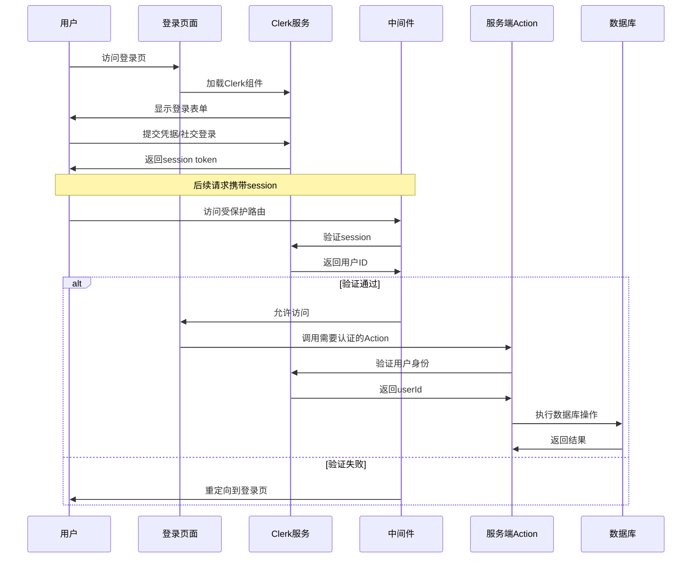

本页面详细介绍项目的认证系统架构，该系统基于 **Clerk** 实现，提供了完整的用户注册、登录和身份验证功能，同时通过中间件实现了细粒度的路由保护。

## 架构概述

项目采用了 **Clerk** 作为第三方认证解决方案，这是一个专为 Next.js 设计的身份验证和用户管理平台。认证系统由以下核心组件构成：

- **Clerk 认证服务** - 提供用户注册、登录、会话管理
- **登录/注册页面** - 使用 Clerk 提供的预构建组件
- **中间件保护** - 拦截请求并验证用户身份
- **服务端 Actions** - 在需要认证的操作中验证用户身份
- **数据库模型** - 存储用户扩展信息

```mermaid
flowchart TD
    User[用户] -->|访问| SignInPage[登录页面<br/>sign-in]
    User -->|访问| SignUpPage[注册页面<br/>sign-up]
    User -->|访问| ProtectedRoutes[受保护路由]
    
    SignInPage -->|Clerk认证| Clerk[Clerk服务]
    SignUpPage -->|Clerk认证| Clerk
    
    ProtectedRoutes -->|经过| Middleware[中间件<br/>middleware.ts]
    Middleware -->|验证session| Clerk
    Clerk -->|通过| AppRoutes[应用页面]
    
    subgraph ServerActions[服务端Actions]
        Action1[switchFollow]
        Action2[switchBlock]
        Action3[updateProfile]
    end
    
    AppRoutes -->|调用| Action1
    AppRoutes -->|调用| Action2
    AppRoutes -->|调用| Action3
    Action1 -->|auth().userId| Clerk
    Action2 -->|auth().userId| Clerk
    Action3 -->|auth().userId| Clerk
    
    Clerk -->|用户ID| DB[(Prisma数据库)]
    
    style Clerk fill:#4f46e5,color:#fff
    style Middleware fill:#059669,color:#fff
    style ProtectedRoutes fill:#dc2626,color:#fff
```

## 认证服务配置

项目使用 Clerk 作为身份验证后端。在中间件中，我们配置了路由保护和认证逻辑：

```typescript
// src/middleware.ts
import { clerkMiddleware, createRouteMatcher } from "@clerk/nextjs/server";

// 定义哪些路由需要保护（必须登录）
const isProtectedRoute = createRouteMatcher([
    "/settings(.*)",  // 设置页
    "/",              // 首页
]);

export default clerkMiddleware(async (auth, req) => {
    if (isProtectedRoute(req)) {
        await auth().protect();
    }
});
```

Sources: [middleware.ts](src/middleware.ts#L1-L25)

### 路由保护规则

| 路由模式 | 保护级别 | 说明 |
|---------|---------|------|
| `/settings(.*)` | 必须登录 | 所有设置相关页面 |
| `/` | 必须登录 | 首页动态信息流 |
| `/api/**` | 必须登录 | 所有API接口 |
| `/sign-in/**` | 公开 | 登录页面 |
| `/sign-up/**` | 公开 | 注册页面 |

### 中间件匹配器配置

```typescript
export const config = {
    matcher: [
        "/((?!_next|favicon.ico|.*\\..*).*)",  // 跳过静态资源
        "/(api|trpc)(.*)",                       // 所有API路径
    ],
};
```

这确保了所有动态路由都会经过中间件验证，只有通过身份验证的用户才能访问受保护资源。

Sources: [middleware.ts](src/middleware.ts#L16-L24)

## 登录与注册页面

项目使用 Clerk 提供的预构建 UI 组件，这些组件支持完整的登录、注册流程，并包含社交登录（OAuth）支持。

### 登录页面实现

```typescript
// src/app/sign-in/[[...sign-in]]/page.tsx
import { SignIn } from '@clerk/nextjs'

export default function Page() {
    return(
    <div className="h-[calc(100vh-96px)] flex items-center justify-center">
        <SignIn />
    </div>
    )
}
```

Sources: [sign-in/[[...sign-in]]/page.tsx](src/app/sign-in/[[...sign-in]]/page.tsx#L1-L10)

### 注册页面实现

```typescript
// src/app/sign-up/[[...sign-up]]/page.tsx
import { SignUp } from '@clerk/nextjs'

export default function Page() {
    return (
        <div className="h-[calc(100vh-96px)] flex items-center justify-center">
            <SignUp />
        </div>
    )
}
```

Sources: [sign-up/[[...sign-up]]/page.tsx](src/app/sign-up/[[...sign-up]]/page.tsx#L1-L10)

这两个页面都采用全屏居中布局，利用 `h-[calc(100vh-96px)]` 计算可用高度（减去导航栏高度）。

## 服务端认证验证

在服务端 Actions 中，我们使用 Clerk 的 `auth()` 函数获取当前用户信息，这是保护 API 端点和敏感操作的核心机制。

### 用户身份验证模式

所有需要认证的服务端操作都遵循相同的验证模式：

```typescript
// src/lib/actions.ts
export const switchFollow = async (userId: string) => {
    const authData = await auth();           // 获取认证数据
    const currentUserId = authData.userId;   // 提取用户ID

    if (!currentUserId) {
        throw new Error("User is not authenticated!");  // 未登录则抛出错误
    }
    // ... 执行业务逻辑
};
```

Sources: [actions.ts](src/lib/actions.ts#L1-L26)

### 核心认证 Actions

项目实现了以下需要身份验证的服务端操作：

| Action 函数 | 功能 | 认证用途 |
|------------|------|---------|
| `switchFollow` | 关注/取消关注用户 | 验证操作者身份 |
| `switchBlock` | 拉黑/取消拉黑用户 | 验证拉黑者身份 |
| `acceptFollowRequest` | 接受关注请求 | 验证接收者身份 |
| `declineFollowRequest` | 拒绝关注请求 | 验证接收者身份 |
| `updateProfile` | 更新个人资料 | 验证资料所有者 |

Sources: [actions.ts](src/lib/actions.ts#L1-L200)

## 数据库用户模型

虽然用户身份由 Clerk 管理，但项目使用 Prisma 存储用户的扩展信息，实现与 Clerk 用户 ID 的关联：

```prisma
// prisma/schema.prisma
model User {
  id           String  @id        // Clerk用户ID
  username     String  @unique    // 用户名
  avatar       String?            // 头像URL
  cover        String?            // 封面图URL
  name         String?            // 名字
  surname      String?            // 姓氏
  description  String?            // 个人简介
  
  // 社交关系
  posts        Post[]
  comments     Comment[]
  likes        Like[]
  followers    Follower[]   @relation("UserFollowers")
  followings   Follower[]   @relation("UserFollowings")
  // ... 更多关联
}
```

Sources: [schema.prisma](prisma/schema.prisma#L16-L42)

### 用户模型设计特点

1. **ID 源自 Clerk** - 用户主键 `id` 直接使用 Clerk 生成的唯一标识符
2. **扩展信息存储** - 通过 Prisma 存储头像、封面、个人简介等扩展字段
3. **社交关系关联** - 通过 Follower、FollowRequest、Block 等模型管理用户间关系
4. **级联删除** - 用户删除时自动清除所有关联数据

## 认证流程全景



## 总结

本项目采用 Clerk 实现了完整的认证解决方案，其优势包括：

- **零信任安全** - 所有受保护路由都经过中间件验证
- **无缝体验** - 预构建组件提供流畅的登录/注册流程
- **服务端保护** - Actions 层二次验证防止绕过
- **数据关联** - 通过 Clerk 用户ID与本地数据库建立关系

如需了解更多实现细节，建议参考：

- [数据库设计](7-shu-ju-ku-she-ji) - 用户模型及关系设计
- [中间件机制](17-zhong-jian-jian-ji-zhi) - 请求拦截详细配置
- [客户端与服务端Actions](15-ke-hu-duan-yu-fu-wu-duan-actions) - 认证状态下Actions的使用方式