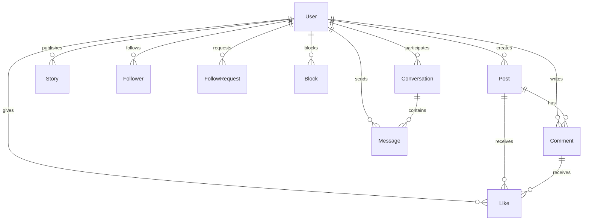

本文档详细介绍 Next.js 社交平台项目的数据库架构设计，基于 Prisma ORM 与 MySQL 数据库实现完整的数据持久化层。数据库设计遵循关系型数据库范式，通过自引用关系实现复杂的社交网络功能。

## 技术栈概览

项目采用 Prisma 作为 ORM 工具，连接 MySQL 数据库。Prisma 提供了类型安全的数据库操作能力，与 TypeScript 项目完美集成。数据源配置位于 `prisma/schema.prisma` 文件中，通过环境变量 `DATABASE_URL` 动态读取连接字符串。



数据源配置定义了数据库连接参数，生成器配置指定了输出客户端库的类型。Sources: [prisma/schema.prisma](prisma/schema.prisma#L1-L14)

## 核心数据模型

项目包含 9 个核心数据模型，涵盖用户管理、内容发布、社交关系和即时通讯四大功能域。以下表格概述各模型的基本结构：

| 模型名称 | 功能域 | 主键类型 | 关联数量 |
|---------|--------|---------|---------|
| User | 用户管理 | String (UUID) | 10个关联 |
| Post | 内容发布 | Int (自增) | 2个关联 |
| Comment | 内容发布 | Int (自增) | 2个关联 |
| Like | 交互系统 | Int (自增) | 多态关联 |
| Follower | 社交关系 | Int (自增) | 自引用 |
| FollowRequest | 社交关系 | Int (自增) | 自引用 |
| Block | 社交关系 | Int (自增) | 自引用 |
| Story | 内容发布 | Int (自增) | 1个关联 |
| Conversation | 即时通讯 | Int (自增) | 2个关联 |
| Message | 即时通讯 | Int (自增) | 2个关联 |

Sources: [prisma/schema.prisma](prisma/schema.prisma#L16-L140)

## 用户模型设计

User 模型是整个数据库的核心，承载用户个人资料和所有业务数据的枢纽。模型采用 String 类型的 UUID 作为主键，与其他模型建立级联删除关系，确保数据一致性。

用户个人资料字段涵盖基本信息、地理位置和职业背景三大类。基础信息包括用户名（唯一约束）、头像、封面图、姓名和描述；地理位置包含城市信息；职业背景涵盖学校和工作单位字段。这些字段全部定义为可选类型，支持用户渐进式完善个人资料。

用户创建时间戳使用默认当前时间，精确记录账号注册时间。所有的关联关系均配置了 `onDelete: Cascade` 删除策略，当用户账号被删除时，其发布的内容、评论、点赞、关注关系等将自动级联删除，避免数据孤岛。

```prisma
model User {
  id                     String          @id
  username               String          @unique
  avatar                 String?
  cover                  String?
  name                   String?
  surname                String?
  description            String?
  city                   String?
  school                 String?
  work                   String?
  website                String?
  createdAt              DateTime        @default(now())
  posts                  Post[]
  comments               Comment[]
  likes                  Like[]
  followers              Follower[]      @relation("UserFollowers")
  followings             Follower[]      @relation("UserFollowings")
  followRequestsSent     FollowRequest[] @relation("FollowRequestsSent")
  followRequestsReceived FollowRequest[] @relation("FollowRequestsReceived")
  blocks                 Block[]         @relation("BlocksSent")
  blockedBy              Block[]         @relation("BlocksReceived")
  stories                Story[]
  conversationsAsParticipant1 Conversation[] @relation("ConversationsAsParticipant1")
  conversationsAsParticipant2 Conversation[] @relation("ConversationsAsParticipant2")
  sentMessages                Message[]
}
```

Sources: [prisma/schema.prisma](prisma/schema.prisma#L16-L42)

## 内容发布模型

内容发布模块由 Post、Comment 和 Story 三个模型组成，支持用户创建文本内容、发表评论和发布限时动态。

Post 模型存储用户发布的动态帖子，包含可选的图片字段。创建时间和更新时间分别记录帖子生命周期中的关键节点。每条帖子都属于特定用户，删除用户时其所有帖子将级联删除。帖子与评论、点赞为一对多关系，支持查询帖子收到的所有交互数据。

Comment 模型实现评论功能，关联到具体的帖子和评论者。评论同样支持被点赞，形成多态的点赞关联结构。Comment 模型的 `updatedAt` 字段自动追踪内容修改时间。

Story 模型实现限时动态功能，每个故事包含过期时间戳 `expiresAt`，前端可据此判断故事是否仍然有效。故事仅包含图片内容，简洁的设计符合 Stories 功能的轻量化特性。

```prisma
model Post {
  id        Int       @id @default(autoincrement())
  desc      String
  img       String?
  createdAt DateTime  @default(now())
  updatedAt DateTime  @updatedAt
  user      User      @relation(fields: [userId], references: [id], onDelete: Cascade)
  userId    String
  comments  Comment[]
  likes     Like[]
}

model Comment {
  id        Int      @id @default(autoincrement())
  desc      String
  createdAt DateTime @default(now())
  updatedAt DateTime @updatedAt
  user      User     @relation(fields: [userId], references: [id], onDelete: Cascade)
  userId    String
  post      Post     @relation(fields: [postId], references: [id], onDelete: Cascade)
  postId    Int
  likes     Like[]
}

model Story {
  id        Int      @id @default(autoincrement())
  createdAt DateTime @default(now())
  expiresAt DateTime
  img       String
  user      User     @relation(fields: [userId], references: [id], onDelete: Cascade)
  userId    String
}
```

Sources: [prisma/schema.prisma](prisma/schema.prisma#L44-L66), [prisma/schema.prisma](prisma/schema.prisma#L110-L117)

## 社交关系模型

社交关系模块包含 Follower、FollowRequest 和 Block 三个模型，通过自引用关系实现用户之间的关注、关注请求和拉黑功能。

Follower 模型采用多对多自引用结构，followerId 表示关注者，followingId 表示被关注者。删除任一用户时，相关关注关系自动清除。数据库未设置唯一约束，允许重复关注（可通过业务层处理重复逻辑）。

FollowRequest 模型实现关注请求功能，当用户关注私有账户时创建请求。模型包含复合唯一约束 `@@unique([senderId, receiverId])`，防止同一用户重复发送请求。接受或拒绝请求后，相关记录会被删除。

Block 模型实现用户拉黑功能，同样采用自引用结构。复合唯一约束确保用户只能将另一用户拉黑一次。被拉黑的用户将无法查看拉黑者的内容或发送消息。

```prisma
model Follower {
  id          Int      @id @default(autoincrement())
  createdAt   DateTime @default(now())
  follower    User     @relation("UserFollowers", fields: [followerId], references: [id], onDelete: Cascade)
  followerId  String
  following   User     @relation("UserFollowings", fields: [followingId], references: [id], onDelete: Cascade)
  followingId String
}

model FollowRequest {
  id         Int      @id @default(autoincrement())
  createdAt  DateTime @default(now())
  sender     User     @relation("FollowRequestsSent", fields: [senderId], references: [id], onDelete: Cascade)
  senderId   String
  receiver   User     @relation("FollowRequestsReceived", fields: [receiverId], references: [id], onDelete: Cascade)
  receiverId String

  @@unique([senderId, receiverId])
}

model Block {
  id        Int      @id @default(autoincrement())
  createdAt DateTime @default(now())
  blocker   User     @relation("BlocksSent", fields: [blockerId], references: [id], onDelete: Cascade)
  blockerId String
  blocked   User     @relation("BlocksReceived", fields: [blockedId], references: [id], onDelete: Cascade)
  blockedId String

  @@unique([blockerId, blockedId])
}
```

Sources: [prisma/schema.prisma](prisma/schema.prisma#L79-L108)

## 交互系统模型

Like 模型实现统一的点赞功能，支持对帖子和评论的点赞。该模型采用多态设计，通过可选的 postId 和 commentId 字段区分点赞目标。一个 Like 记录只能关联帖子或评论之一，不能同时关联两者。

```prisma
model Like {
  id        Int      @id @default(autoincrement())
  createdAt DateTime @default(now())
  user      User     @relation(fields: [userId], references: [id], onDelete: Cascade)
  userId    String
  post      Post?    @relation(fields: [postId], references: [id], onDelete: Cascade)
  postId    Int?
  Comment   Comment? @relation(fields: [commentId], references: [id], onDelete: Cascade)
  commentId Int?
}
```

Sources: [prisma/schema.prisma](prisma/schema.prisma#L68-L77)

## 即时通讯模型

即时通讯模块由 Conversation 和 Message 两个模型组成，实现用户之间的一对一私聊功能。

Conversation 模型存储会话元数据，通过 participant1Id 和 participant2Id 两个外键关联两位参与者。复合唯一约束 `@@unique([participant1Id, participant2Id])` 确保任意两位用户之间只能存在一个会话，避免重复创建会话。

Message 模型存储具体的消息内容，包含发送者、所属会话和已读状态。isRead 字段用于追踪消息是否被读取，支持实现未读消息计数功能。删除会话时，该会话下的所有消息将级联删除。

```prisma
model Conversation {
  id             Int       @id @default(autoincrement())
  createdAt      DateTime  @default(now())
  participant1Id String
  participant2Id String
  participant1   User      @relation("ConversationsAsParticipant1", fields: [participant1Id], references: [id], onDelete: Cascade)
  participant2   User      @relation("ConversationsAsParticipant2", fields: [participant2Id], references: [id], onDelete: Cascade)
  messages       Message[]

  @@unique([participant1Id, participant2Id])
}

model Message {
  id             Int          @id @default(autoincrement())
  createdAt      DateTime     @default(now())
  text           String
  senderId       String
  sender         User         @relation(fields: [senderId], references: [id], onDelete: Cascade)
  conversationId Int
  conversation   Conversation @relation(fields: [conversationId], references: [id], onDelete: Cascade)
  isRead         Boolean      @default(false)
}
```

Sources: [prisma/schema.prisma](prisma/schema.prisma#L119-L140)

## 数据库设计原则

本项目的数据库设计遵循以下核心原则：

**关系完整性**：所有涉及用户的关联均配置级联删除策略，确保删除用户时相关数据一并清理，避免数据库中存在孤立记录。

**查询优化**：对于高频查询场景（如用户主页、动态流），通过合理的索引设计和关联关系预加载，支撑页面快速渲染。

**可扩展性**：字段采用可选类型设计，支持功能迭代时渐进添加新字段；模型间关系清晰，便于后续扩展群组聊天、帖子收藏等功能。

**社交图谱实现**：通过自引用关系巧妙实现社交网络的关注、拉黑等核心功能，复用 User 模型作为关系节点。

## 相关文档

完成数据库设计学习后，建议继续阅读以下文档深入了解项目实现：

- [认证系统](6-ren-zheng-xi-tong) — 了解用户认证流程与安全机制
- [动态帖子系统](9-dong-tai-tie-zi-xi-tong) — 深入理解帖子与评论的业务实现
- [消息功能](10-xiao-xi-gong-neng) — 即时通讯功能的完整实现
- [朋友与社交](11-peng-you-yu-she-jiao) — 关注关系与社交功能的实现细节