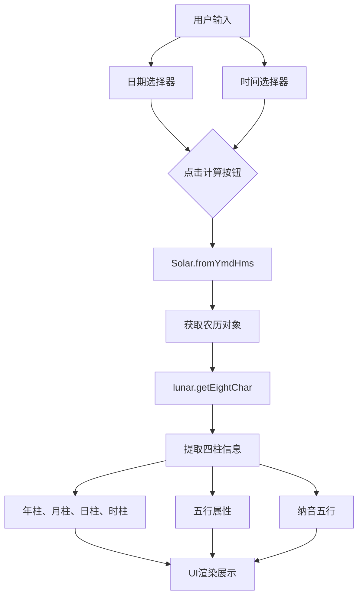

八字计算器是本项目中的一个实用工具模块，基于中国传统的命理学理论，通过输入公历出生日期和时间，计算出对应的生辰八字（四柱八字）、五行属性以及纳音五行。该功能集成于工具系统中，作为起名参考的重要依据。

## 1. 功能架构概览

八字计算器采用客户端计算模式，无需后端API支持，直接在浏览器端完成从公历到农历再到八字的完整转换流程。核心计算能力由 `lunar-javascript` 库提供，该库实现了完整的农历历法转换和八字排盘算法。



**技术栈依赖**: 项目通过 `lunar-javascript` v1.7.7 实现所有历法计算，该库是 Lunar Calendar（紫金山天文台日历算法）的 JavaScript 实现版本，支持精确的公农历转换和八字排盘。

Sources: [package.json](package.json#L17), [BaziCalculator.tsx](src/components/BaziCalculator.tsx#L1-L51)

## 2. 核心组件实现

### 2.1 组件数据结构

`BaziCalculator` 组件使用 React 的 `useState` 钩子管理两个核心状态：用户输入的日期和时间，以及计算结果。状态定义如下：

| 状态变量 | 类型 | 用途 |
|---------|------|------|
| `date` | string | 存储用户选择的出生日期（YYYY-MM-DD格式） |
| `time` | string | 存储用户选择的出生时间（HH:mm格式） |
| `result` | object | 存储计算结果，包含八字、五行、纳音等信息 |

结果对象的具体结构如下：

```typescript
{
    year: string;      // 年柱 + 年干五行
    month: string;     // 月柱 + 月干五行
    day: string;       // 日柱 + 日干五行（日主）
    hour: string;      // 时柱 + 时干五行
    wuxing: string;    // 四柱五行汇总
    nayin: string;     // 四柱纳音汇总
    info: string;      // 农历详细信息
}
```

Sources: [BaziCalculator.tsx](src/components/BaziCalculator.tsx#L6-L17)

### 2.2 八字计算核心逻辑

组件的 `calculateBazi` 函数实现了完整的八字排盘流程。当用户未填写时间时，系统默认使用中午12点（午时）作为默认值，这在时辰信息缺失的场景下是合理的处理方式。

计算流程分为四个关键步骤：首先解析用户输入的日期时间字符串；然后创建 `Solar`（阳历/公历）对象；接着通过 `getLunar()` 方法获取对应的农历对象；最后调用 `getEightChar()` 获取八字信息。

```typescript
const solar = Solar.fromYmdHms(year, month, day, h, m, 0);
const lunar = solar.getLunar();
const bazi = lunar.getEightChar();
```

通过 `bazi` 对象可以获取以下核心数据：

| 方法 | 返回值 | 含义 |
|------|--------|------|
| `getYear()` | 甲子、乙丑... | 年柱天干地支 |
| `getMonth()` | 丙寅、丁卯... | 月柱天干地支 |
| `getDay()` | 戊子、己丑... | 日柱天干地支 |
| `getTime()` | 壬戌、癸亥... | 时柱天干地支 |
| `getYearWuXing()` | 木、火、土、金、水 | 年干五行 |
| `getNaYin()` | 海中金、炉中火... | 纳音五行 |

Sources: [BaziCalculator.tsx](src/components/BaziCalculator.tsx#L19-L51)

## 3. 用户界面设计

### 3.1 输入表单区域

界面采用简洁的垂直表单布局，包含两个主要输入字段：

**出生日期输入**：使用 HTML5 原生 `<input type="date">` 组件，支持各浏览器的日期选择器UI。标签明确说明"出生日期（公历/阳历）"，帮助用户理解需要输入的是公历日期而非农历。

**出生时间输入**：使用 `<input type="time">` 组件，标签标注为"选填，精确到时辰"。时间精确到分钟，但八字计算实际只精确到时辰（2小时为一个时辰），这是传统命理的规范。默认值为空，如果为空则系统使用12:00作为默认值。

**计算按钮**：采用蓝色主色调的按钮，悬停时颜色加深以提供交互反馈。

Sources: [BaziCalculator.tsx](src/components/BaziCalculator.tsx#L53-L84)

### 3.2 结果展示区域

计算结果以卡片形式呈现，使用琥珀色背景（`bg-amber-50`）营造传统文化的氛围。结果区域分为以下几个部分：

**标题栏**：显示"排盘结果"，带底部边框装饰。

**农历信息**：显示转换后的农历年份、月份、日期和时辰，使用中文数字表示（如：二〇二四年五月十五 子时）。

**四柱展示**：采用四列网格布局，依次展示年柱、月柱、日柱、时柱。每一列包含两个信息：上方为天干地支（如甲子），下方为对应的五行属性（如木）。日柱特别标注为"日主"，表示日干代表命主本人。

**五行汇总**：分为"八字五行"和"八字纳音"两行，分别展示四个天干的五行和纳音属性。

**免责声明**：底部以小字号灰色文字提示"注：本工具采用真太阳时排盘，结果仅供起名、娱乐参考"，明确工具的使用边界。

Sources: [BaziCalculator.tsx](src/components/BaziCalculator.tsx#L86-L126)

## 4. 工具系统集成

### 4.1 入口配置

八字计算器作为工具列表中的一项，通过 `Tools` 组件进行展示和管理。在 `tools` 数组配置中，八字计算器的定义如下：

```typescript
{ id: 5, name: "生辰八字测算", icon: "/map.png", link: "/tools/bazi" }
```

该配置指定了工具名称为"生辰八字测算"，使用 `/map.png` 作为图标，并通过 `/tools/bazi` 链接指向八字计算器页面。需要注意的是，工具列表中其他项目多为外部链接（使用 `target="_blank"`），而八字计算器使用内部路由，这使得它成为本项目原生支持的功能模块。

Sources: [Tools.tsx](src/components/Tools.tsx#L4-L10)

### 4.2 路由对应关系

八字计算器的访问路径 `/tools/bazi` 对应 Next.js 的页面路由。在 Next.js 15 的 App Router 架构下，该页面应该位于 `src/app/tools/bazi/page.tsx`，组件通过服务端或客户端渲染方式加载 `BaziCalculator` 组件。

## 5. 技术特性与限制

### 5.1 客户端计算优势

采用纯客户端计算的架构具有以下优势：

**响应速度**：无需网络请求，数据转换即时完成，用户体验流畅。

**隐私安全**：用户的出生日期时间仅在本地浏览器中处理，不会上传至服务器，符合隐私保护原则。

**降低服务器负载**：计算密集型任务分散到客户端，无需服务端部署专门的计算服务。

### 5.2 已知限制

**真太阳时问题**：组件注释中提到"采用真太阳时排盘"，但实际代码中直接使用用户输入的标准时间（北京时间），未进行真太阳时校正。真太阳时需要根据出生地的经度计算时差，这在纯前端实现中较为复杂。

**时区处理**：当前实现假设用户输入的时间为固定时区（系统时区），未提供时区选择器，这可能导致跨时区使用时结果存在偏差。

**误差说明**：界面明确标注结果"仅供起名、娱乐参考"，表明开发团队对计算精度持谨慎态度。

## 6. 延伸学习路径

完成对八字计算器模块的学习后，建议继续深入以下相关主题：

若需了解该组件在页面中的具体路由配置，可参考 [API路由设计](16-apilu-you-she-ji) 了解 Next.js 的路由机制；若希望学习更多工具类组件的实现方式，可查阅 [组件系统概述](12-zu-jian-xi-tong-gai-shu)；若对项目中使用到的第三方库感兴趣，可查看 [环境配置与依赖](5-huan-jing-pei-zhi-yu-yi-lai) 了解更多依赖信息。